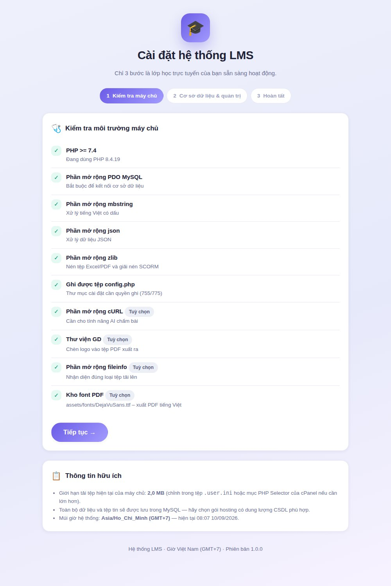

# 🎓 Hệ thống LMS — Quản lý học tập trực tuyến

Hệ thống quản lý học tập (LMS) viết bằng **PHP thuần + HTML + CSS**, giao diện tiếng Việt tươi sáng,
thiết kế để **tải thẳng lên hosting chia sẻ (cPanel)** mà không cần Composer, Node.js hay quyền SSH.

> Toàn bộ dữ liệu — kể cả tệp học liệu, ảnh, video và gói SCORM — được lưu trong **MySQL**.
> Hệ thống không cần thư mục ghi trên hosting.

📘 [Hướng dẫn cài đặt](docs/HUONG-DAN-CAI-DAT.md) ·
📗 [Hướng dẫn sử dụng đầy đủ ảnh minh hoạ](docs/HUONG-DAN-SU-DUNG.md) ·
📜 [Lịch sử phiên bản](CHANGELOG.md)

---


---

## ✨ Tính năng chính

| Nhóm | Chi tiết |
|---|---|
| 👥 **Người dùng** | 3 vai trò: quản trị viên, giáo viên, học sinh. Đăng ký, phê duyệt, khoá/mở, đặt lại mật khẩu, hồ sơ cá nhân, ảnh đại diện |
| 🔐 **Đăng ký tài khoản** | Quản trị viên **bật/tắt riêng** đăng ký của giáo viên và của học sinh; tuỳ chọn bắt buộc phê duyệt |
| 🎓 **Khoá học** | Danh mục, chương, ảnh bìa, màu sắc, mã ghi danh, ghi danh tự do / cần mã / cần duyệt / thủ công, giới hạn sĩ số, giáo viên đồng phụ trách |
| 📚 **Học liệu** | Trang nội dung, tệp (Word, PDF, PowerPoint, Excel, ZIP…), video (tải lên hoặc YouTube/Vimeo), liên kết ngoài, nhiều tệp đính kèm |
| 🧩 **SCORM** | Nhập gói **SCORM 1.2 và SCORM 2004** (.zip), tự phân tích `imsmanifest.xml`, mục lục nhiều SCO, ghi nhận `lesson_status`, `score.raw`, `suspend_data`, thời gian học; dùng làm học liệu hoặc bài tập tính điểm |
| 📝 **Bài tập** | Hạn nộp, hạn đóng, cho nộp trễ, nhiều lần nộp, nộp tệp và/hoặc gõ trực tiếp, giới hạn định dạng, chấm điểm + nhận xét |
| ❓ **Trắc nghiệm** | 5 dạng câu hỏi, giới hạn thời gian, trộn câu/đáp án, nhiều lượt làm, tự động chấm, tự lưu từng câu |
| 🤖 **AI chấm bài** | Tuỳ chỉnh **nhà cung cấp, Endpoint URL, API key, model, max_tokens (mặc định 64000), timeout (mặc định 300s), temperature, header phụ, system prompt**; hỗ trợ OpenAI / Anthropic / Gemini / mọi API tương thích OpenAI; đọc được cả **ảnh chụp bài viết tay** |
| ∑ **LaTeX & hình ảnh** | Công thức toán (MathJax **cài kèm, chạy được khi không có Internet**) trong bài giảng, học liệu, đề bài, câu hỏi, thảo luận. Trình soạn thảo có nút **chèn ảnh (tải lên hoặc dán từ clipboard)**, bảng, video và **hơn 20 mẫu công thức Toán – Lí – Hoá** |
| 📊 **Sổ điểm & thống kê** | Bảng điểm ma trận có hệ số, quy đổi thang 10, xếp loại, phổ điểm, tiến độ học tập, biểu đồ SVG (không cần thư viện ngoài). **Không giới hạn số đầu điểm**: cột được đánh số kèm bảng chú thích, ghim cột họ tên và cụm kết quả khi cuộn ngang |
| 📤 **Xuất dữ liệu** | **Excel (.xlsx), PDF (tiếng Việt có dấu), CSV** cho bảng điểm, danh sách lớp, tiến độ, kết quả bài tập/trắc nghiệm/SCORM và danh sách người dùng. Bảng điểm PDF **tự chia thành nhiều phần theo chiều ngang** khi lớp có nhiều đầu điểm |
| 💬 **Tương tác** | Diễn đàn theo lớp, thông báo lớp, thông báo toàn hệ thống, hộp thông báo cá nhân |
| 🎨 **Tuỳ biến** | Tên website, tên đơn vị, logo, favicon, ảnh trang chủ, màu chủ đạo, **dòng bản quyền chân trang**, thông tin liên hệ, chế độ bảo trì |
| ⏱️ **Phiên làm việc** | Phiên lưu trong MySQL, mặc định **12 giờ** (chỉnh được), tự động "giữ phiên" để học sinh làm bài dài không bị đăng xuất |
| 🕘 **Múi giờ** | Toàn hệ thống dùng **giờ Việt Nam (Asia/Ho_Chi_Minh, GMT+7)**, cả PHP lẫn MySQL |

---

## 📸 Một vài màn hình

<table>
<tr>
<td width="50%"><b>Bài giảng có công thức và hình minh hoạ</b><br></td>
<td width="50%"><b>Chấm bài với trợ lý AI</b><br></td>
</tr>
<tr>
<td><b>Sổ điểm lớp</b><br></td>
<td><b>Thống kê &amp; báo cáo</b><br></td>
</tr>
<tr>
<td><b>Thư viện mẫu công thức LaTeX</b><br></td>
<td><b>Học bài giảng SCORM</b><br></td>
</tr>
<tr>
<td><b>Làm bài trắc nghiệm</b><br></td>
<td><b>Bảng điểm PDF tiếng Việt</b><br></td>
</tr>
</table>

👉 Xem đầy đủ 60 ảnh minh hoạ trong [Hướng dẫn sử dụng](docs/HUONG-DAN-SU-DUNG.md).

---

## 🚀 Cài đặt nhanh (cPanel)

1. Tải mã nguồn, **giải nén và tải toàn bộ nội dung thư mục `src/`** lên `public_html`
   (hoặc chạy `bash tools/build-package.sh` để tạo sẵn tệp ZIP rồi upload + Extract trong File Manager).
2. Trong cPanel → **MySQL Databases**: tạo cơ sở dữ liệu, tạo người dùng và gán **ALL PRIVILEGES**.
3. Mở trình duyệt tới `https://ten-mien-cua-ban/install.php` và làm theo 3 bước.
4. Cài xong hãy **xoá tệp `install.php`**.



👉 Hướng dẫn chi tiết: [docs/HUONG-DAN-CAI-DAT.md](docs/HUONG-DAN-CAI-DAT.md)

### Yêu cầu máy chủ

| Bắt buộc | Nên có |
|---|---|
| PHP 7.4 trở lên (khuyến nghị 8.1+) | cURL — dùng cho AI chấm bài |
| Phần mở rộng: `pdo_mysql`, `mbstring`, `json`, `zlib` | GD — chèn logo vào PDF |
| MySQL 5.7+ / MariaDB 10.3+ | `fileinfo` — nhận diện loại tệp |

---

## 📁 Cấu trúc thư mục

```
src/                     ← tải toàn bộ nội dung thư mục này lên public_html
├── index.php            Bộ điều phối chính (mọi trang đi qua index.php?r=...)
├── install.php          Trình cài đặt web (xoá sau khi cài xong)
├── media.php            Phục vụ tệp lưu trong MySQL (ảnh, tài liệu, video, hỗ trợ tua video)
├── scorm.php            Phục vụ nội dung bên trong gói SCORM
├── config.php           Do trình cài đặt tạo ra (chứa thông tin CSDL)
├── .htaccess / .user.ini Cấu hình Apache / PHP cho hosting
├── app/
│   ├── bootstrap.php    Khởi động: cấu hình, CSDL, phiên, múi giờ
│   ├── schema.php       Toàn bộ lược đồ MySQL + cấu hình mặc định
│   ├── Database.php     Lớp PDO gọn nhẹ
│   ├── Auth.php         Xác thực & phân quyền
│   ├── Session.php      Phiên lưu trong MySQL
│   ├── Storage.php      Kho tệp trong MySQL (chia mảnh 512KB)
│   ├── Zip.php          Đọc/ghi ZIP bằng PHP thuần
│   ├── Xlsx.php         Xuất Excel không cần thư viện ngoài
│   ├── Pdf.php          Xuất PDF nhúng font TrueType (tiếng Việt có dấu)
│   ├── Scorm.php        Nhập & chạy gói SCORM
│   ├── Ai.php           Kết nối API AI chấm bài
│   ├── controllers/     Bộ điều khiển theo chức năng
│   └── views/           Giao diện
├── assets/
│   ├── css/app.css      Toàn bộ giao diện
│   ├── js/app.js        Tương tác chung
│   ├── js/editor.js     Thanh soạn thảo: chèn ảnh, công thức LaTeX
│   ├── js/scorm-api.js  Bộ điều hợp SCORM 1.2 / 2004
│   ├── js/mathjax/      MathJax bản rút gọn (dùng offline)
│   ├── img/             Hình minh hoạ SVG
│   └── fonts/           Font DejaVu cho xuất PDF tiếng Việt
docs/                    Tài liệu hướng dẫn + ảnh minh hoạ
tools/build-package.sh   Đóng gói ZIP để upload cPanel
```

---

## 🔒 Ghi chú bảo mật

- Mật khẩu băm bằng `password_hash()` (bcrypt).
- Mọi biểu mẫu có mã CSRF; truy vấn dùng prepared statement.
- Nội dung người dùng nhập được lọc thẻ HTML nguy hiểm (giữ nguyên công thức LaTeX).
- Tệp trong `app/` từ chối truy cập trực tiếp qua trình duyệt.
- Tệp HTML/SVG do người dùng tải lên luôn bị buộc tải về, không chạy trong tên miền.
- Hãy **xoá `install.php`** sau khi cài đặt và đặt mật khẩu quản trị đủ mạnh.

---

## 📜 Giấy phép

Mã nguồn dùng tự do cho mục đích giáo dục.

Thư viện đi kèm:
- **DejaVu Sans** (`assets/fonts/`) — DejaVu Fonts License (Bitstream Vera).
- **MathJax 3** (`assets/js/mathjax/`) — Apache License 2.0.
