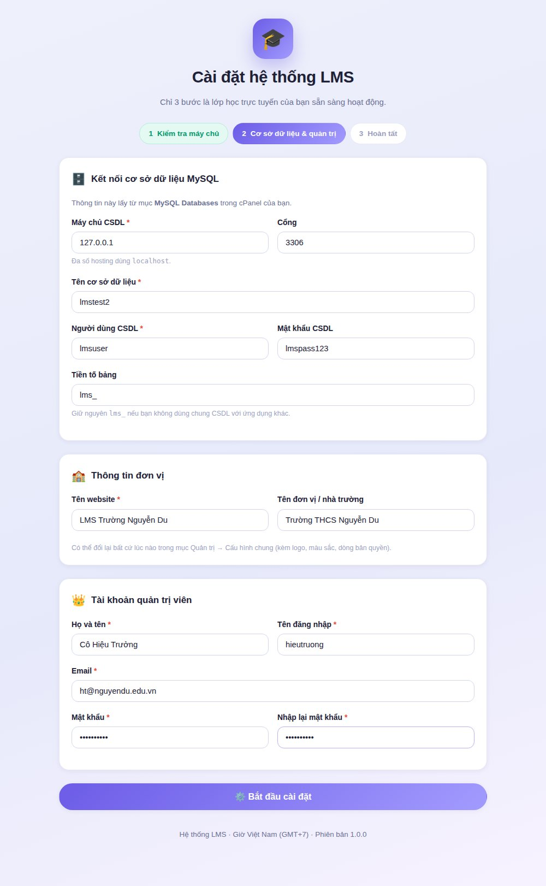
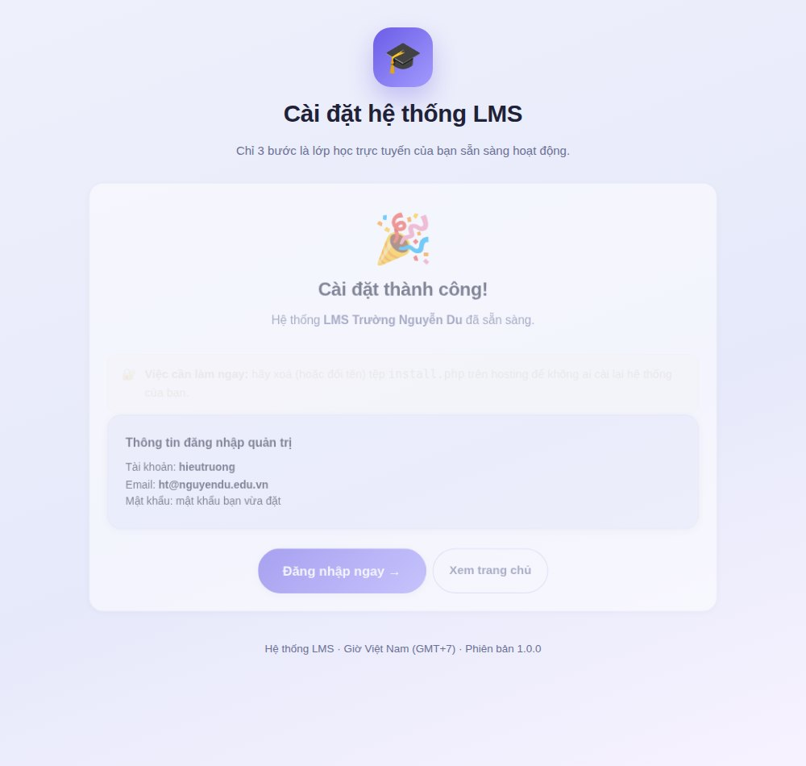

# 📘 Hướng dẫn cài đặt hệ thống LMS lên hosting cPanel

Tài liệu này viết cho thầy cô và cán bộ phụ trách công nghệ thông tin của nhà trường,
**không cần biết lập trình** vẫn cài được.

Thời gian dự kiến: **10–15 phút**.

---

## 1. Chuẩn bị

Bạn cần có:

- Một tài khoản hosting có **cPanel** (hoặc DirectAdmin, aaPanel — thao tác tương tự).
- PHP **7.4 trở lên** (khuyến nghị 8.1 hoặc 8.2).
- Một cơ sở dữ liệu **MySQL / MariaDB**.
- Tên miền hoặc tên miền phụ đã trỏ về hosting.

> 💡 **Lưu ý về dung lượng:** hệ thống lưu **cả tệp học liệu vào cơ sở dữ liệu**.
> Nếu trường dùng nhiều video, hãy chọn gói hosting có dung lượng CSDL rộng rãi
> (tối thiểu 1 GB cho một trường vừa).

---

## 2. Tạo cơ sở dữ liệu MySQL

1. Đăng nhập cPanel → mục **Databases** → **MySQL® Databases**.
2. **Create New Database**: nhập tên, ví dụ `lms` → bấm *Create Database*.
   cPanel sẽ tạo tên đầy đủ dạng `taikhoan_lms` — hãy **ghi lại tên này**.
3. Kéo xuống **MySQL Users → Add New User**: nhập tên người dùng và mật khẩu mạnh
   (bấm *Password Generator* rồi lưu lại mật khẩu).
4. Kéo xuống **Add User To Database**: chọn người dùng vừa tạo và cơ sở dữ liệu vừa tạo →
   *Add* → tích **ALL PRIVILEGES** → *Make Changes*.

Ghi lại 4 thông tin sau, lát nữa sẽ dùng:

| Thông tin | Ví dụ |
|---|---|
| Máy chủ CSDL | `localhost` |
| Tên cơ sở dữ liệu | `truonghoc_lms` |
| Người dùng CSDL | `truonghoc_lmsuser` |
| Mật khẩu CSDL | `••••••••••` |

---

## 3. Tải mã nguồn lên hosting

### Cách A — Dùng File Manager (khuyên dùng)

1. Nén sẵn tệp cài đặt:
   - Nếu bạn tải mã nguồn từ GitHub: giải nén, vào thư mục `src/`, **chọn toàn bộ tệp bên trong** và nén lại thành `lms.zip`.
   - Hoặc chạy `bash tools/build-package.sh` trên máy tính để tự tạo `dist/lms-<ngày>.zip`.
2. cPanel → **File Manager** → mở thư mục `public_html`.
3. Bấm **Upload**, chọn `lms.zip`.
4. Quay lại `public_html`, chuột phải vào `lms.zip` → **Extract**.
5. Xoá tệp `lms.zip` sau khi giải nén.

> ⚠️ Sau khi giải nén, trong `public_html` phải nhìn thấy trực tiếp các tệp
> `index.php`, `install.php`, `media.php`, `scorm.php` và các thư mục `app/`, `assets/`.
> Nếu chúng nằm lồng trong một thư mục con (ví dụ `public_html/src/…`),
> hãy chọn tất cả rồi **Move** ra ngoài `public_html`.

### Cách B — Dùng FTP

Dùng FileZilla kết nối tới hosting và tải **nội dung bên trong thư mục `src/`** vào `public_html`.

### Cài vào thư mục con

Muốn chạy tại `truong.edu.vn/lms` thì tạo thư mục `public_html/lms` và tải mã nguồn vào đó.
Hệ thống tự nhận đường dẫn, không cần cấu hình thêm.

---

## 4. Chạy trình cài đặt

1. Mở trình duyệt, truy cập:

   ```
   https://ten-mien-cua-ban/install.php
   ```

   

2. **Bước 1 – Kiểm tra máy chủ.** Màn hình liệt kê các yêu cầu.
   - Dấu ✓ xanh: đạt.
   - Dấu ✕ đỏ: bắt buộc phải khắc phục (liên hệ nhà cung cấp hosting để bật phần mở rộng còn thiếu).
   - Dấu ! vàng: tuỳ chọn, có thể bỏ qua (nhưng nên có cURL để dùng AI chấm bài).

3. **Bước 2 – Cơ sở dữ liệu & quản trị viên.** Điền 4 thông tin CSDL ở mục 2,
   tên website, tên đơn vị và tài khoản quản trị viên.

   

4. Bấm **⚙️ Bắt đầu cài đặt**. Hệ thống sẽ tạo hơn 25 bảng dữ liệu và tệp `config.php`.

5. **Bước 3 – Hoàn tất.** Đăng nhập bằng tài khoản quản trị vừa tạo.

   

---

## 5. Việc cần làm ngay sau khi cài

### 5.1. Xoá tệp cài đặt (bắt buộc)

cPanel → File Manager → `public_html` → xoá tệp **`install.php`**.

### 5.2. Tăng giới hạn tải tệp

Mặc định nhiều hosting chỉ cho tải tệp 2 MB. Cách tăng:

- **Cách 1 (đơn giản):** mã nguồn đã kèm sẵn tệp `.user.ini` với `upload_max_filesize = 64M`.
  Đợi khoảng 5 phút hoặc vào cPanel → **MultiPHP INI Editor** → chọn tên miền → Save để nạp lại.
- **Cách 2:** cPanel → **MultiPHP INI Editor** → chế độ *Basic* → chỉnh:

  | Thông số | Giá trị đề nghị |
  |---|---|
  | `upload_max_filesize` | 64M |
  | `post_max_size` | 72M |
  | `memory_limit` | 256M |
  | `max_execution_time` | 600 |

Vào **Quản trị → Cấu hình chung** trong LMS, mục *Tải tệp & lưu trữ* sẽ hiển thị
giới hạn thực tế mà máy chủ đang cho phép.

### 5.3. Kiểm tra giới hạn gói dữ liệu của MySQL

Nếu tải tệp lớn mà báo lỗi *"max_allowed_packet"*, vào
**Quản trị → Cấu hình chung → Kích thước mảnh lưu CSDL** và giảm xuống `256` KB.

### 5.4. Tuỳ biến thương hiệu nhà trường


**Quản trị → Cấu hình chung**:

- Tên website, khẩu hiệu, tên đơn vị.
- Logo, favicon, ảnh minh hoạ trang chủ.
- Màu chủ đạo, màu nhấn.
- **Dòng bản quyền chân trang**, thông tin liên hệ.

### 5.5. Bật/tắt đăng ký tài khoản


**Quản trị → Cấu hình chung → Đăng ký tài khoản**:

- *Cho phép học sinh tự đăng ký* — bật/tắt.
- *Cho phép giáo viên tự đăng ký* — **bật/tắt riêng biệt** theo yêu cầu của nhà trường.
- *Giáo viên đăng ký phải chờ duyệt* — tài khoản mới ở trạng thái "chờ duyệt"
  cho tới khi quản trị viên xác nhận tại **Quản trị → Người dùng**.

### 5.6. Cấu hình AI chấm bài (tuỳ chọn)


**Quản trị → Trợ lý AI chấm bài**:

| Trường | Ý nghĩa |
|---|---|
| Nhà cung cấp | OpenAI / Anthropic / Gemini / Tuỳ chỉnh (tương thích OpenAI) |
| Endpoint URL | Địa chỉ API, ví dụ `https://api.openai.com/v1/chat/completions` |
| API Key | Khoá do nhà cung cấp cấp |
| Tên model | Ví dụ `gpt-4o-mini`, `claude-sonnet-4-5`, `gemini-2.0-flash` |
| Token tối đa | Mặc định **64000** |
| Timeout | Mặc định **300** giây |
| Temperature | Mặc định 0.2 (thấp = chấm ổn định) |
| Header phụ | Dành cho các API cần header riêng (OpenRouter…) |
| System prompt | "Tính cách" của trợ lý chấm bài |

Bấm **🔍 Kiểm tra kết nối** để thử ngay trước khi lưu.

> Sau đó, trong từng bài tập, thầy cô bật *"Cho phép AI chấm bài tập này"* và nhập
> **tiêu chí chấm (rubric)**. Có thể chọn chấm tự động ngay khi học sinh nộp,
> và có lấy điểm AI làm điểm chính thức hay chỉ để tham khảo.

### 5.7. Công thức toán (LaTeX) và hình minh hoạ

Mặc định đã bật. Trong **Quản trị → Cấu hình chung → Công thức toán & trình soạn thảo**:

- Bật/tắt MathJax.
- Cho phép hay không cú pháp `$...$` (tắt nếu nội dung có nhiều ký hiệu tiền tệ).
- Đổi địa chỉ thư viện MathJax. **Mặc định hệ thống dùng bản MathJax cài kèm trong mã nguồn**
  (`assets/js/mathjax/tex-mml-chtml.js`) nên công thức hiển thị được cả khi máy chủ hoặc học sinh
  không truy cập được Internet. Muốn dùng bản đầy đủ trên CDN thì điền
  `https://cdn.jsdelivr.net/npm/mathjax@3/es5/tex-mml-chtml.js`.


---

## 6. Sao lưu và phục hồi

Vì mọi thứ nằm trong MySQL, chỉ cần sao lưu cơ sở dữ liệu:

- cPanel → **Backup** → *Download a MySQL Database Backup*, hoặc
- cPanel → **phpMyAdmin** → chọn CSDL → tab **Export** → *Go*.

Phục hồi: tạo CSDL mới, dùng phpMyAdmin **Import** tệp `.sql`, rồi cập nhật lại
thông tin trong `config.php`.

> 💡 Nên hẹn lịch sao lưu tự động hằng tuần trong cPanel.

---

## 7. Xử lý sự cố thường gặp

| Hiện tượng | Nguyên nhân & cách xử lý |
|---|---|
| Trang trắng, không hiện gì | Mở `config.php`, đổi `'debug' => false` thành `true` để xem lỗi chi tiết. Nhớ đổi lại sau khi sửa xong. |
| *"Không kết nối được cơ sở dữ liệu"* | Sai tên CSDL / người dùng / mật khẩu trong `config.php`, hoặc chưa gán ALL PRIVILEGES. |
| Tải tệp lớn báo lỗi | Xem mục **5.2** và **5.3**. |
| Học sinh bị đăng xuất giữa chừng | **Quản trị → Cấu hình chung → Thời gian sống của phiên**, tăng lên (43200 giây = 12 giờ) và bật *Tự động giữ phiên*. |
| Gói SCORM không chạy | Kiểm tra gói `.zip` có tệp `imsmanifest.xml` ở gốc; một số hosting tắt `PATH_INFO` — hệ thống đã có cơ chế dự phòng, hãy thử tải lại trang. |
| Công thức toán hiện dạng `\(x^2\)` | Máy chủ/học sinh không tải được MathJax từ Internet — xem mục **5.7** để dùng bản nội bộ. |
| PDF xuất ra thiếu chữ | Kiểm tra thư mục `assets/fonts/` có đủ `DejaVuSans.ttf` và `DejaVuSans-Bold.ttf`. |
| Trang quản trị báo 403 | Đăng nhập bằng tài khoản có vai trò *Quản trị viên*. |

---

## 8. Nâng cấp phiên bản

1. Sao lưu cơ sở dữ liệu (mục 6).
2. Tải đè các tệp mới, **giữ nguyên `config.php`**.
3. Truy cập lại trang chủ — hệ thống tự bổ sung bảng/cột còn thiếu, **không mất dữ liệu**.

---

## 9. Bước tiếp theo

Sau khi cài đặt xong, mời đọc 👉 **[Hướng dẫn sử dụng đầy đủ kèm ảnh minh hoạ](HUONG-DAN-SU-DUNG.md)**
để tạo khoá học, soạn bài có công thức toán, giao bài tập và chấm bài bằng AI.

Lịch sử các phiên bản: [CHANGELOG.md](../CHANGELOG.md)

---

Chúc nhà trường triển khai thành công! 🎉
