# 📗 Hướng dẫn sử dụng hệ thống LMS

Tài liệu hướng dẫn đầy đủ, kèm ảnh minh hoạ cho **quản trị viên**, **giáo viên** và **học sinh**.

> Toàn bộ ảnh trong tài liệu này được chụp trực tiếp từ hệ thống đang chạy.

---

## 📑 Mục lục

- [Phần 0 — Làm quen giao diện](#phần-0--làm-quen-giao-diện)
- [Phần I — Dành cho Quản trị viên 👑](#phần-i--dành-cho-quản-trị-viên-)
  - [1. Tổng quan hệ thống](#1-tổng-quan-hệ-thống)
  - [2. Quản lý người dùng](#2-quản-lý-người-dùng)
  - [3. Bật/tắt đăng ký tài khoản giáo viên](#3-bậttắt-đăng-ký-tài-khoản-giáo-viên)
  - [4. Tuỳ biến thương hiệu nhà trường](#4-tuỳ-biến-thương-hiệu-nhà-trường)
  - [5. Phiên làm việc — chống bị đăng xuất khi làm bài](#5-phiên-làm-việc--chống-bị-đăng-xuất-khi-làm-bài)
  - [6. Công thức toán và trình soạn thảo](#6-công-thức-toán-và-trình-soạn-thảo)
  - [6b. Xem trước tệp học liệu](#6b-xem-trước-tệp-học-liệu)
  - [7. Cấu hình trợ lý AI chấm bài](#7-cấu-hình-trợ-lý-ai-chấm-bài)
  - [8. Danh mục khoá học](#8-danh-mục-khoá-học)
  - [9. Kho dữ liệu](#9-kho-dữ-liệu)
  - [10. Nhật ký và thông báo hệ thống](#10-nhật-ký-và-thông-báo-hệ-thống)
- [Phần II — Dành cho Giáo viên 👩‍🏫](#phần-ii--dành-cho-giáo-viên-)
  - [1. Bảng điều khiển](#1-bảng-điều-khiển-giáo-viên)
  - [2. Tạo khoá học](#2-tạo-khoá-học)
  - [3. Xây dựng nội dung khoá học](#3-xây-dựng-nội-dung-khoá-học)
  - [4. Soạn bài có công thức toán và hình minh hoạ](#4-soạn-bài-có-công-thức-toán-và-hình-minh-hoạ)
  - [5. Đưa gói SCORM lên hệ thống](#5-đưa-gói-scorm-lên-hệ-thống)
  - [6. Giao bài tập](#6-giao-bài-tập)
  - [7. Soạn bài trắc nghiệm](#7-soạn-bài-trắc-nghiệm)
  - [8. Chấm bài — thủ công và bằng AI](#8-chấm-bài--thủ-công-và-bằng-ai)
  - [9. Sổ điểm và xuất báo cáo](#9-sổ-điểm-và-xuất-báo-cáo)
  - [10. Quản lý học viên và thông báo lớp](#10-quản-lý-học-viên-và-thông-báo-lớp)
- [Phần III — Dành cho Học sinh 🧑‍🎓](#phần-iii--dành-cho-học-sinh-)
- [Phần IV — Mẹo nhỏ & câu hỏi thường gặp](#phần-iv--mẹo-nhỏ--câu-hỏi-thường-gặp)

---

## Phần 0 — Làm quen giao diện

### Trang chủ

Trang chủ giới thiệu nhà trường, các con số thống kê, tính năng nổi bật và khoá học đang mở.
Toàn bộ tên website, khẩu hiệu, logo và màu sắc đều **tuỳ biến được** trong phần quản trị.


### Đăng nhập

Đăng nhập bằng **tên tài khoản hoặc email**. Tích *Ghi nhớ đăng nhập* để lần sau vào nhanh hơn.


### Đăng ký tài khoản

Người dùng mới chọn vai trò **Học sinh** hoặc **Giáo viên** (nếu nhà trường cho phép).
Tài khoản giáo viên thường phải chờ quản trị viên phê duyệt.


### Khám phá khoá học

Ai cũng xem được danh mục khoá học đang mở, lọc theo môn học và từ khoá.

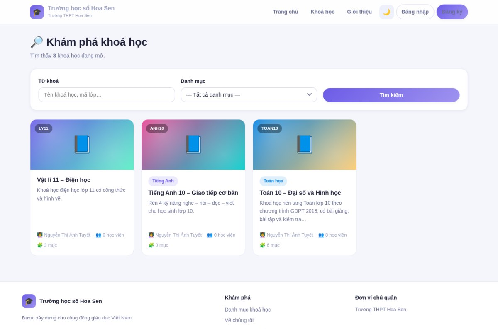

### Bố cục chung

| Vùng | Chức năng |
|---|---|
| **Thanh bên trái** | Điều hướng theo vai trò. Trên điện thoại bấm ☰ để mở |
| **Thanh trên cùng** | 🔍 tìm khoá học · 🌙 đổi giao diện sáng/tối · 🔔 thông báo · avatar tài khoản |
| **Vùng nội dung** | Nội dung trang hiện tại |

Giao diện tối (dark mode) chỉ cần bấm nút 🌙:

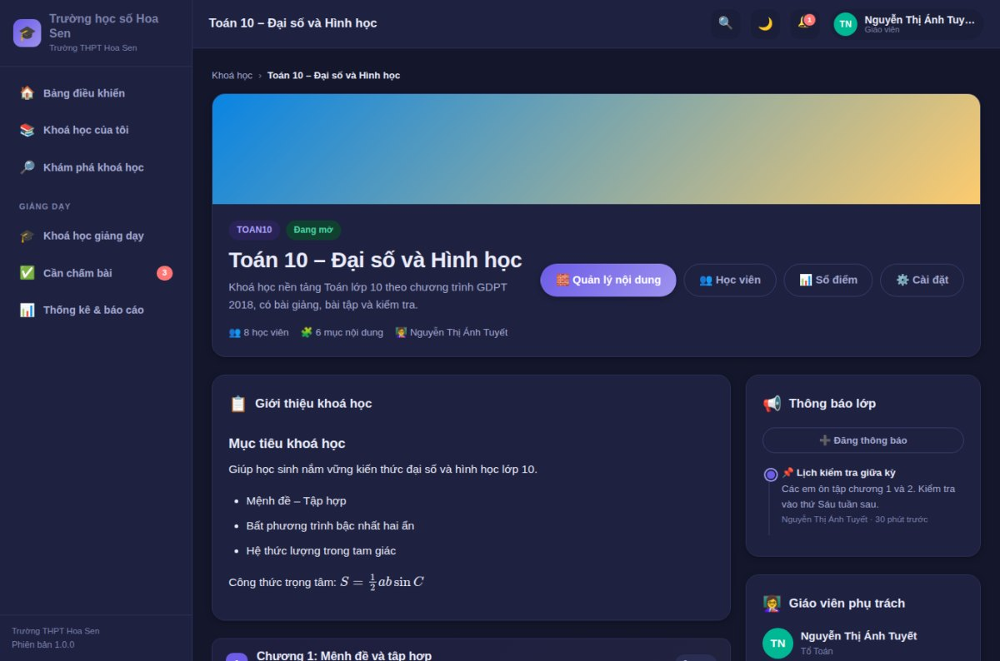

---

## Phần I — Dành cho Quản trị viên 👑

### 1. Tổng quan hệ thống

`Quản trị → Tổng quan hệ thống`

Màn hình cho biết ngay: số người dùng, khoá học, mục nội dung, lượt nộp bài, số người đang trực
tuyến, dung lượng cơ sở dữ liệu, biểu đồ đăng nhập 14 ngày, tài khoản chờ duyệt và nhật ký gần đây.

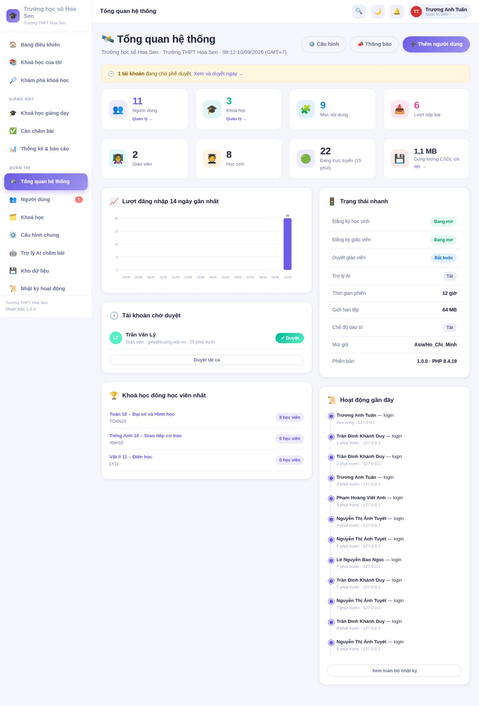

> 💡 Khối **Trạng thái nhanh** bên phải cho biết ngay các công tắc quan trọng đang bật hay tắt:
> đăng ký học sinh/giáo viên, trợ lý AI, thời gian phiên, giới hạn tệp, chế độ bảo trì.

### 2. Quản lý người dùng

`Quản trị → Người dùng`

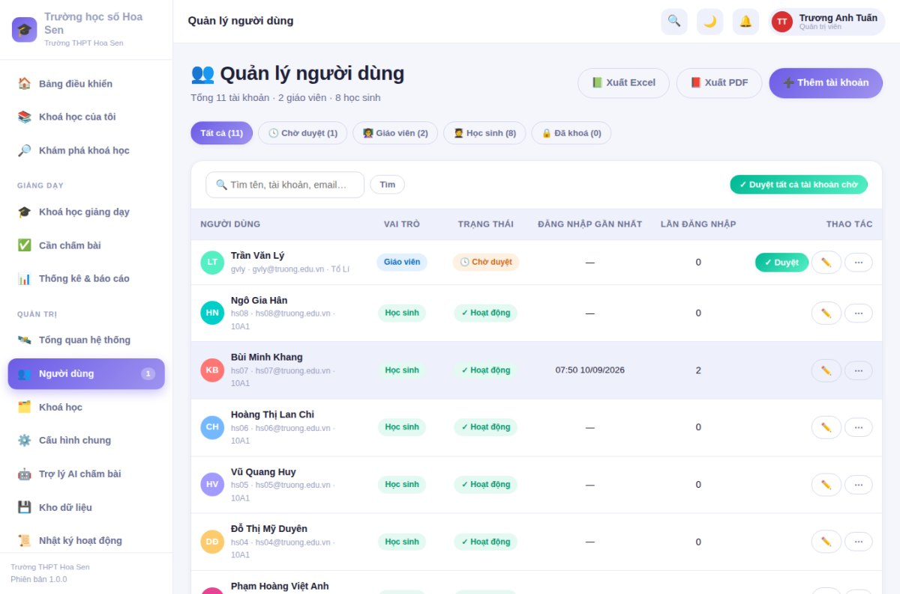

Các thao tác:

| Thao tác | Cách làm |
|---|---|
| **Lọc nhanh** | Bấm các thẻ *Chờ duyệt · Giáo viên · Học sinh · Đã khoá* ở đầu trang |
| **Tìm kiếm** | Gõ tên, tài khoản hoặc email vào ô tìm kiếm |
| **Duyệt tài khoản** | Bấm **✓ Duyệt** ở dòng tương ứng, hoặc **Duyệt tất cả tài khoản chờ** |
| **Đặt lại mật khẩu** | Menu **⋯** → *Đặt lại mật khẩu*. Hệ thống sinh mật khẩu mới và hiển thị **một lần** — hãy sao chép gửi cho người dùng |
| **Khoá / mở khoá** | Menu **⋯**. Khoá tài khoản sẽ đăng xuất người đó khỏi mọi thiết bị |
| **Xoá tài khoản** | Menu **⋯** → *Xoá tài khoản* (không thể hoàn tác) |
| **Xuất danh sách** | Nút **📗 Xuất Excel** hoặc **📕 Xuất PDF** ở góc trên |

Thêm tài khoản thủ công (dùng khi nhà trường tắt đăng ký tự do):

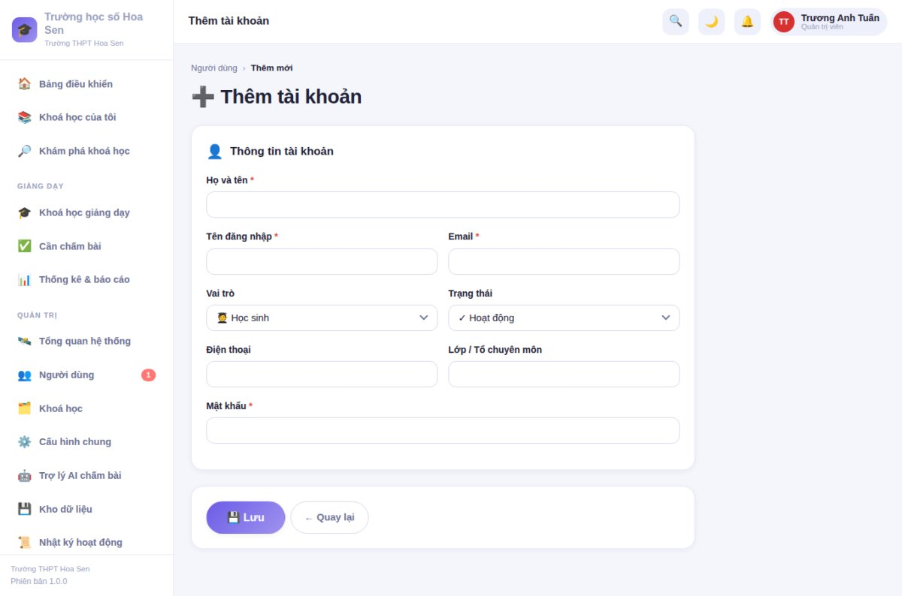

### 3. Bật/tắt đăng ký tài khoản giáo viên

`Quản trị → Cấu hình chung` → khối **🙋 Đăng ký tài khoản**

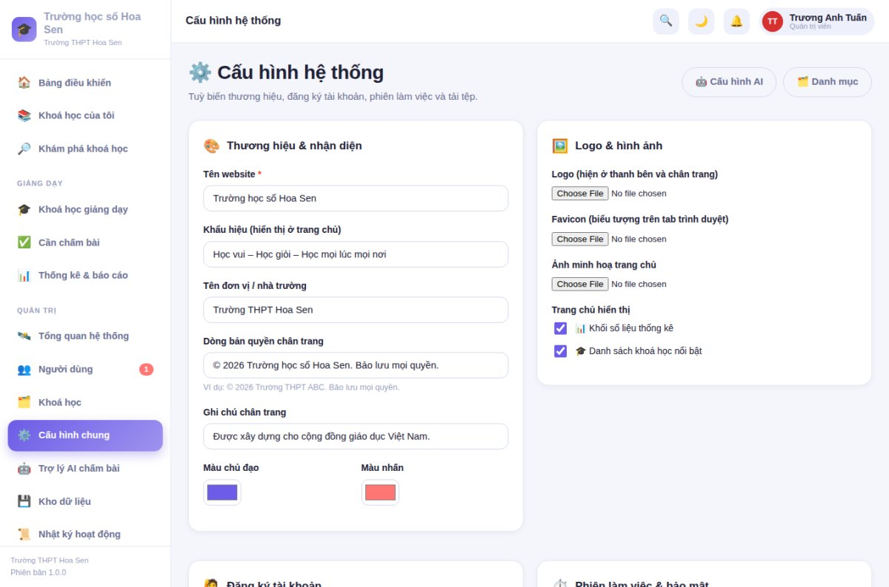

| Công tắc | Khi bật | Khi tắt |
|---|---|---|
| **Cho phép học sinh tự đăng ký** | Trang đăng ký hiện lựa chọn "🧑‍🎓 Học sinh" | Ẩn lựa chọn này |
| **Cho phép giáo viên tự đăng ký** | Trang đăng ký hiện lựa chọn "👩‍🏫 Giáo viên" | Ẩn lựa chọn này |
| **Giáo viên đăng ký phải chờ duyệt** | Tài khoản mới ở trạng thái *chờ duyệt*, chưa đăng nhập được | Đăng ký xong dùng ngay |
| **Học sinh đăng ký phải chờ duyệt** | Tương tự, áp dụng cho học sinh | Đăng ký xong dùng ngay |

> Nếu **tắt cả hai**, trang đăng ký hiển thị thông báo lịch sự và chỉ còn nút đăng nhập —
> phù hợp với trường cấp tài khoản tập trung.

Ô **Ghi chú hiển thị ở trang đăng ký** dùng để nhắc học sinh, ví dụ:
*"Học sinh dùng email do nhà trường cấp để đăng ký."*

### 4. Tuỳ biến thương hiệu nhà trường

`Quản trị → Cấu hình chung` → khối **🎨 Thương hiệu & nhận diện**

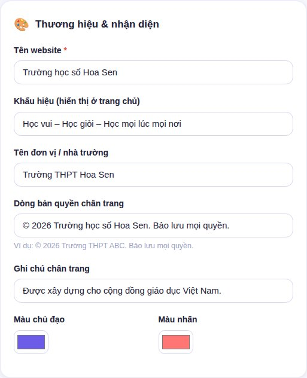

- **Tên website** — hiển thị ở thanh bên, tiêu đề trang và mọi tệp xuất ra.
- **Khẩu hiệu** — dòng chữ dưới tiêu đề ở trang chủ.
- **Tên đơn vị / nhà trường** — in ở đầu bảng điểm PDF, chân trang.
- **Dòng bản quyền chân trang** — ví dụ `© 2026 Trường THPT ABC. Bảo lưu mọi quyền.`
- **Màu chủ đạo / màu nhấn** — đổi màu toàn hệ thống, kể cả tiêu đề bảng trong tệp Excel và PDF.

Khối **🖼️ Logo & hình ảnh** ngay bên cạnh cho phép tải lên **logo**, **favicon**
(biểu tượng trên tab trình duyệt) và **ảnh minh hoạ trang chủ**.

### 5. Phiên làm việc — chống bị đăng xuất khi làm bài

`Quản trị → Cấu hình chung` → khối **⏱️ Phiên làm việc & bảo mật**

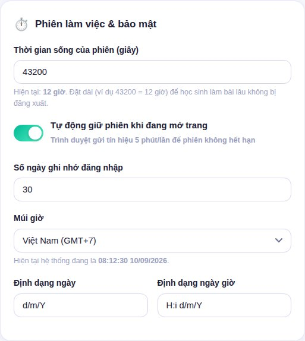

- **Thời gian sống của phiên**: mặc định `43200` giây = **12 giờ**. Đặt dài để học sinh làm bài
  hoặc học SCORM lâu không bị đăng xuất giữa chừng.
- **Tự động giữ phiên**: trình duyệt gửi tín hiệu 5 phút một lần khi trang còn mở, phiên không hết hạn.
- **Số ngày ghi nhớ đăng nhập**: áp dụng cho ô *Ghi nhớ đăng nhập* ở trang đăng nhập.
- **Múi giờ**: mặc định **Asia/Ho_Chi_Minh (GMT+7)**, áp dụng cho cả PHP lẫn MySQL.

### 6. Công thức toán và trình soạn thảo

`Quản trị → Cấu hình chung` → khối **∑ Công thức toán & trình soạn thảo**

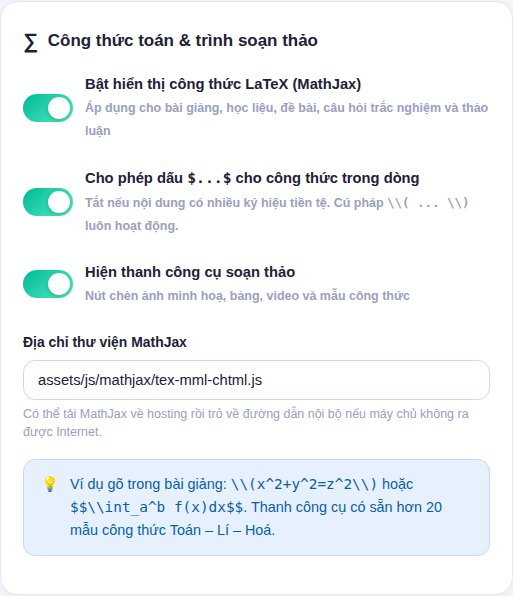

- **Bật hiển thị công thức LaTeX (MathJax)** — áp dụng cho bài giảng, học liệu, đề bài,
  câu hỏi trắc nghiệm, bài làm của học sinh và diễn đàn.
- **Cho phép dấu `$...$`** — tắt nếu nội dung có nhiều ký hiệu tiền tệ; cú pháp `\( ... \)` luôn hoạt động.
- **Hiện thanh công cụ soạn thảo** — nút chèn ảnh, bảng, video và mẫu công thức.
- **Địa chỉ thư viện MathJax** — mặc định dùng bản **cài kèm trong mã nguồn**
  (`assets/js/mathjax/tex-mml-chtml.js`) nên chạy được cả khi máy chủ không có Internet.

### 6b. Xem trước tệp học liệu

`Quản trị → Cấu hình chung` → khối **👁️ Xem trước tệp học liệu**

- **Mở tệp đính kèm ngay trên web** — bật (mặc định) thì mọi tệp Word, Excel, PowerPoint,
  OpenDocument, PDF, ảnh, video, âm thanh, văn bản, mã nguồn và tệp nén đều xem được ngay,
  không cần tải về. Tắt thì hệ thống chỉ hiện nút tải về như trước.
- **Chỉ xem trước tệp nhỏ hơn (MB)** — mặc định `25`. Chỉ áp dụng cho các định dạng cần
  máy chủ bóc tách nội dung (Word, Excel, PowerPoint, văn bản, tệp nén); ảnh, PDF, video
  và âm thanh do trình duyệt phát trực tiếp nên không bị giới hạn.

> 💡 Toàn bộ việc đọc tệp do PHP tự làm, **không gửi tệp ra dịch vụ bên ngoài** —
> học liệu của nhà trường không rời khỏi máy chủ.

### 7. Cấu hình trợ lý AI chấm bài

`Quản trị → Trợ lý AI chấm bài`

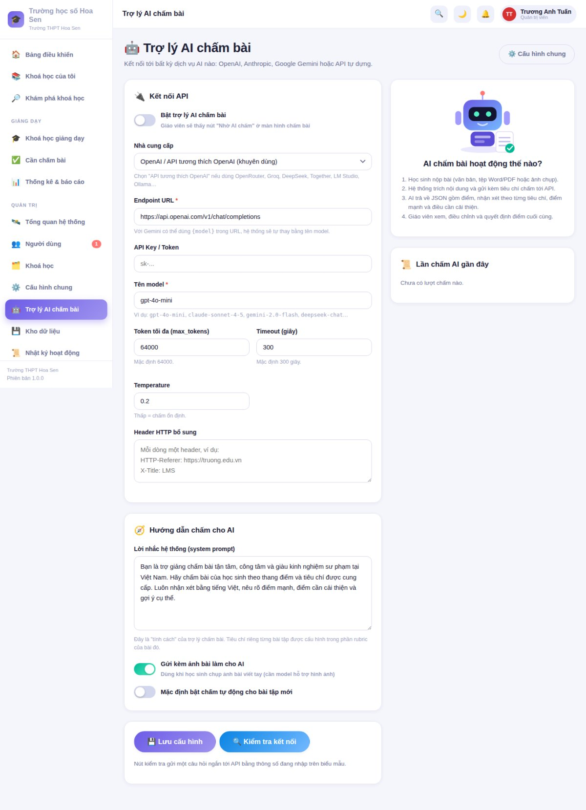

| Trường | Ý nghĩa | Ví dụ |
|---|---|---|
| **Bật trợ lý AI chấm bài** | Công tắc tổng của cả hệ thống | — |
| **Nhà cung cấp** | OpenAI / Anthropic / Google Gemini / Tuỳ chỉnh | *OpenAI / API tương thích* |
| **Endpoint URL** | Địa chỉ API | `https://api.openai.com/v1/chat/completions` |
| **API Key / Token** | Khoá do nhà cung cấp cấp (được lưu mã hoá trong CSDL, hiển thị dạng •••) | `sk-...` |
| **Tên model** | Mô hình sử dụng | `gpt-4o-mini`, `claude-sonnet-4-5`, `gemini-2.0-flash` |
| **Token tối đa** | `max_tokens` gửi kèm mỗi lần chấm | **64000** (mặc định) |
| **Timeout** | Thời gian chờ tối đa | **300** giây (mặc định) |
| **Temperature** | Độ "sáng tạo"; thấp = chấm ổn định | `0.2` |
| **Header HTTP bổ sung** | Cho API cần header riêng (OpenRouter…) | `HTTP-Referer: https://truong.edu.vn` |
| **Lời nhắc hệ thống** | "Tính cách" của trợ lý chấm bài | *Bạn là trợ giảng chấm bài tận tâm…* |
| **Gửi kèm ảnh bài làm** | Cho phép AI đọc ảnh chụp bài viết tay | Bật |

Bấm **🔍 Kiểm tra kết nối** để thử ngay bằng thông số đang nhập — hệ thống báo rõ thành công
hay lỗi (sai khoá, sai địa chỉ, hết thời gian chờ…) trước khi lưu.

> Dùng được với mọi dịch vụ tương thích OpenAI: OpenRouter, Groq, DeepSeek, Together,
> LM Studio hay Ollama chạy nội bộ trong trường.

### 8. Danh mục khoá học

`Quản trị → Danh mục` — đặt tên, biểu tượng, màu và thứ tự cho từng môn học.

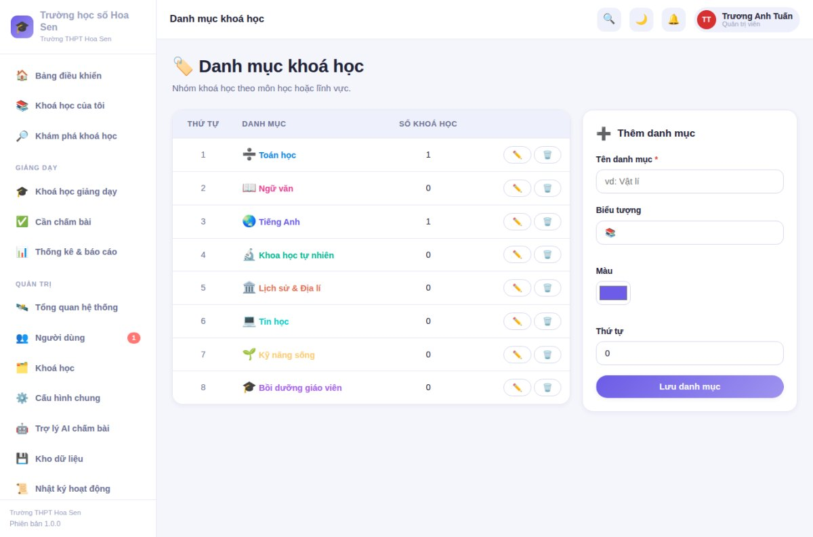

### 9. Kho dữ liệu

`Quản trị → Kho dữ liệu`

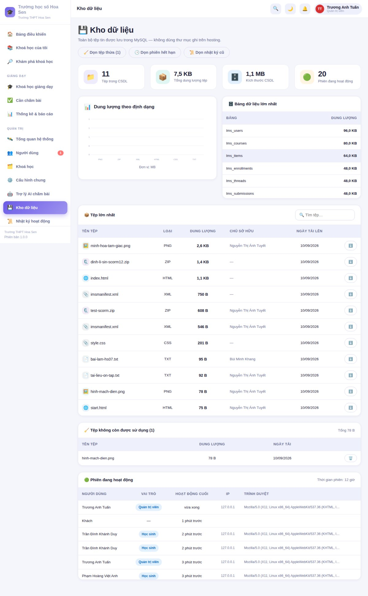

- Xem tổng số tệp, dung lượng tệp, kích thước cơ sở dữ liệu và số phiên đang hoạt động.
- Biểu đồ **dung lượng theo định dạng tệp** giúp phát hiện video chiếm chỗ.
- **🧹 Dọn tệp thừa** — xoá các tệp không còn được mục nội dung, bài nộp hay gói SCORM nào dùng tới.
- **🕒 Dọn phiên hết hạn** và **📜 Dọn nhật ký cũ** (hơn 90 ngày).
- Danh sách **phiên đang hoạt động** cho biết ai đang online, từ địa chỉ IP nào.

### 10. Nhật ký và thông báo hệ thống

Nhật ký ghi lại đăng nhập, tạo/sửa/xoá khoá học, chấm bài, đổi cấu hình…

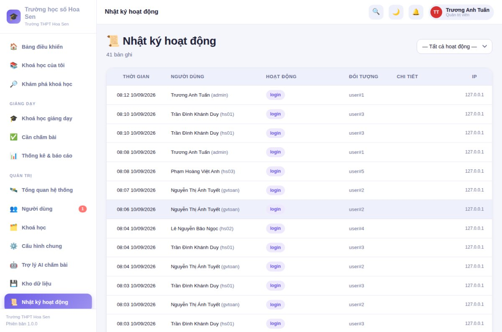

Thông báo toàn hệ thống hiển thị trên bảng điều khiển của **mọi thành viên**, có thể ghim lên đầu
và gửi kèm thông báo cá nhân:

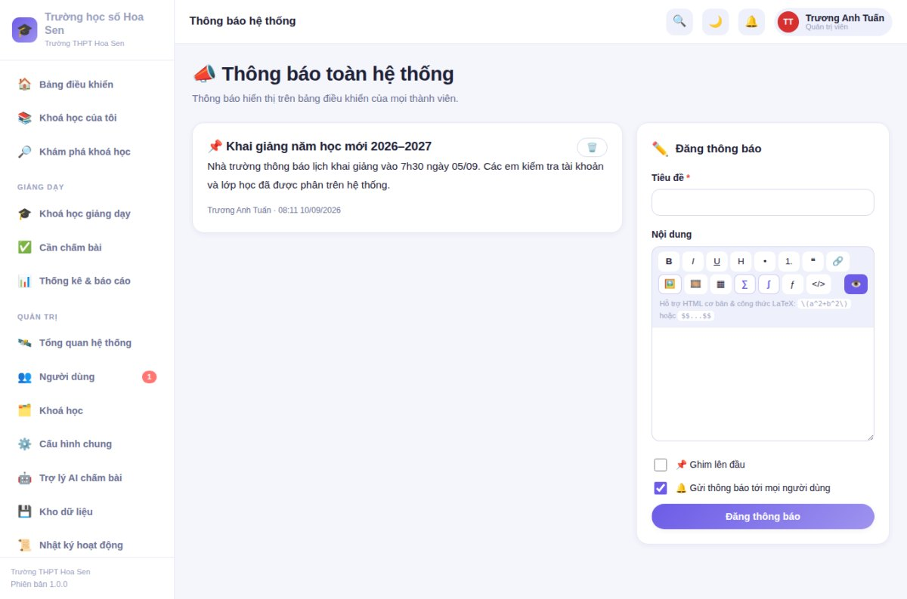

---

## Phần II — Dành cho Giáo viên 👩‍🏫

### 1. Bảng điều khiển giáo viên

Ngay khi đăng nhập, thầy cô thấy: số khoá đang dạy, số học viên, **bài chờ chấm**,
lượt nộp 7 ngày qua, danh sách bài cần chấm và biểu đồ hoạt động.

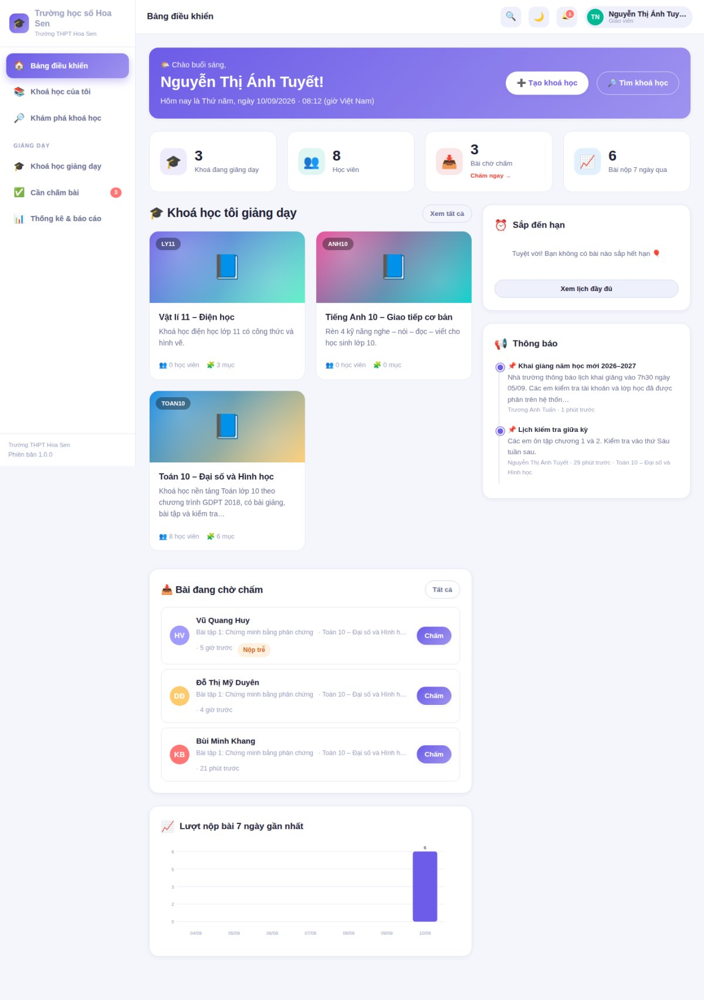

Danh sách khoá học đang giảng dạy — mỗi thẻ có nút nhanh: 🧱 nội dung · 👥 học viên · 📊 sổ điểm · ⚙️ cài đặt:

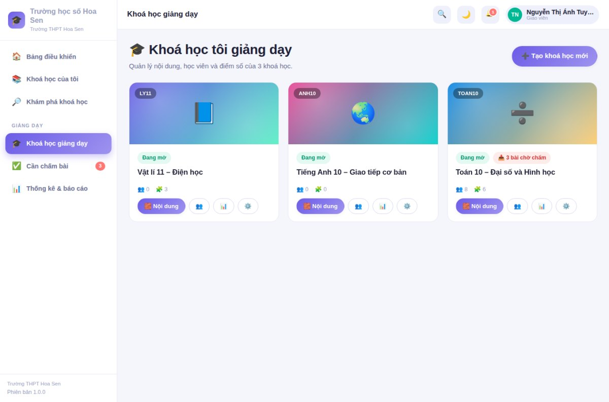

### 2. Tạo khoá học

`Khoá học giảng dạy → ➕ Tạo khoá học mới`

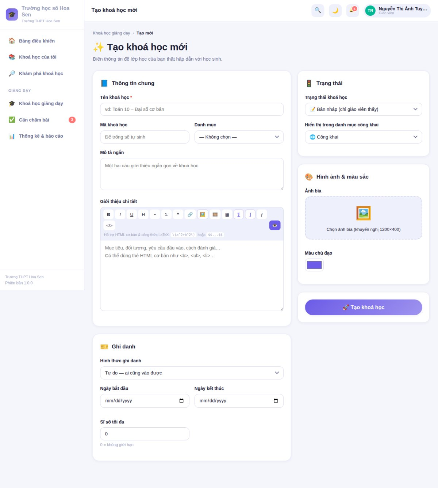

**Các mục cần điền:**

1. **Tên khoá học** *(bắt buộc)* — ví dụ *Toán 10 – Đại số và Hình học*.
2. **Mã khoá học** — để trống hệ thống tự sinh.
3. **Danh mục** — chọn môn học.
4. **Mô tả ngắn** và **Giới thiệu chi tiết** (có thể chèn công thức, hình ảnh, video).
5. **Hình thức ghi danh**:

   | Kiểu | Ý nghĩa |
   |---|---|
   | Tự do | Học sinh nào cũng vào được |
   | Cần mã ghi danh | Thầy cô phát mã cho lớp mình |
   | Cần giáo viên duyệt | Học sinh gửi yêu cầu, thầy cô duyệt |
   | Chỉ giáo viên thêm | Học sinh không tự vào được |

6. **Trạng thái**: *Bản nháp* (soạn riêng) → *Đang mở* (học sinh vào học) → *Lưu trữ*.
7. **Ảnh bìa, màu chủ đạo, sĩ số tối đa, ngày bắt đầu – kết thúc**.

### 3. Xây dựng nội dung khoá học

`Khoá học → 🧱 Quản lý nội dung`

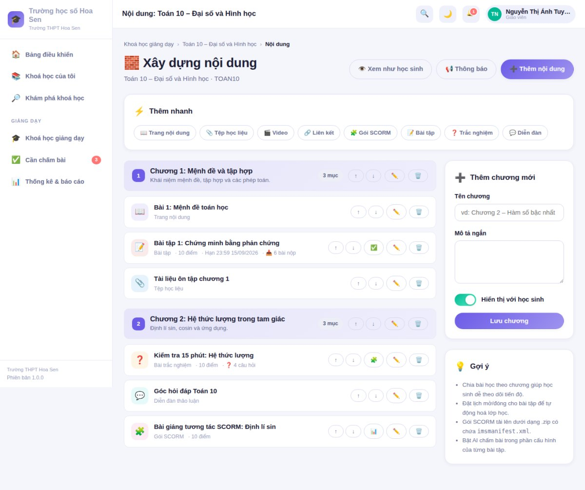

**Bước 1 — Tạo chương.** Dùng khung *Thêm chương mới* bên phải (ví dụ *Chương 1: Mệnh đề và tập hợp*).

**Bước 2 — Thêm mục nội dung.** Bấm **➕ Thêm nội dung** hoặc dùng dãy nút **⚡ Thêm nhanh**.
Có 8 loại:

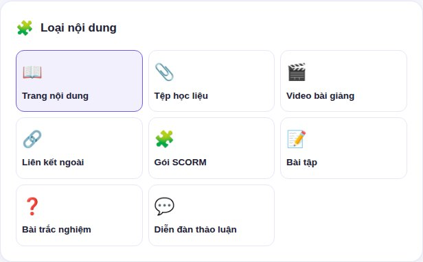

| Loại | Dùng khi |
|---|---|
| 📖 **Trang nội dung** | Bài giảng viết trực tiếp: chữ, công thức, hình ảnh, video nhúng |
| 📎 **Tệp học liệu** | Word, PDF, PowerPoint, Excel, ZIP… (PDF và ảnh xem trước ngay trên web) |
| 🎬 **Video bài giảng** | Tải video lên hoặc dán liên kết YouTube/Vimeo |
| 🔗 **Liên kết ngoài** | Tài nguyên trên web |
| 🧩 **Gói SCORM** | Bài giảng đóng gói từ Articulate, iSpring, Captivate, H5P… |
| 📝 **Bài tập** | Học sinh nộp tệp và/hoặc gõ bài |
| ❓ **Bài trắc nghiệm** | Kiểm tra, tự động chấm |
| 💬 **Diễn đàn thảo luận** | Không gian hỏi đáp của lớp |

**Bước 3 — Cấu hình hiển thị** ở cột phải: thuộc chương nào, hiển thị/ẩn,
**giờ mở – giờ đóng**, tính điểm vào sổ, **điểm tối đa** và **hệ số**.

> 🔼🔽 Dùng hai mũi tên để sắp xếp lại thứ tự các mục và các chương.

### 4. Soạn bài có công thức toán và hình minh hoạ

Ô soạn thảo nội dung có **thanh công cụ** đầy đủ:

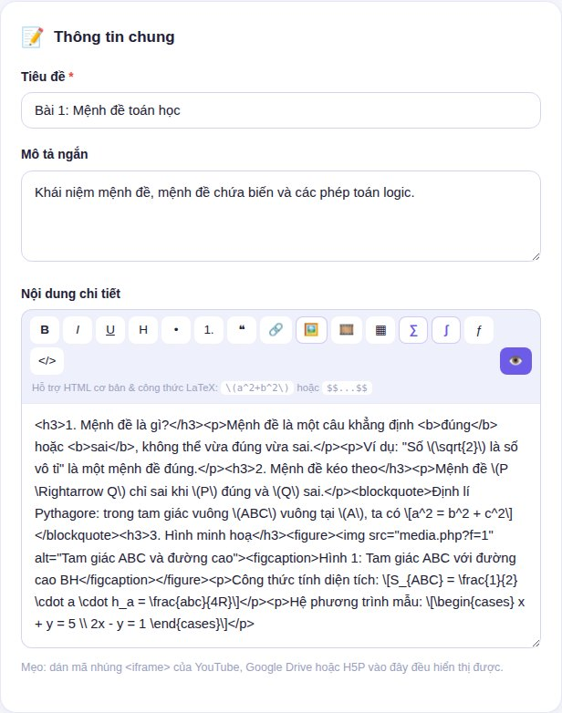

| Nút | Chức năng |
|---|---|
| **B** · *I* · U · H · • · 1. · ❝ | Đậm, nghiêng, gạch chân, tiêu đề mục, danh sách, trích dẫn |
| 🔗 | Chèn liên kết |
| 🖼️ | **Tải ảnh minh hoạ lên và chèn vào bài** (kèm chú thích) |
| 🎞️ | Nhúng video YouTube / Vimeo / iframe |
| ▦ | Chèn bảng (tự hỏi số dòng, số cột) |
| **∑** | Công thức **trong dòng**: `\( ... \)` |
| **∫** | Công thức **riêng dòng**: `\[ ... \]` |
| **ƒ** | Thư viện **mẫu công thức** dựng sẵn |
| `</>` | Khối mã |
| 👁️ | **Xem trước** có render công thức |

#### Thư viện mẫu công thức

Bấm nút **ƒ** để mở hộp mẫu — hơn 20 công thức Toán, Lí, Hoá thường dùng.
Bấm vào mẫu là công thức được chèn ngay vào vị trí con trỏ, kèm ô xem trước:

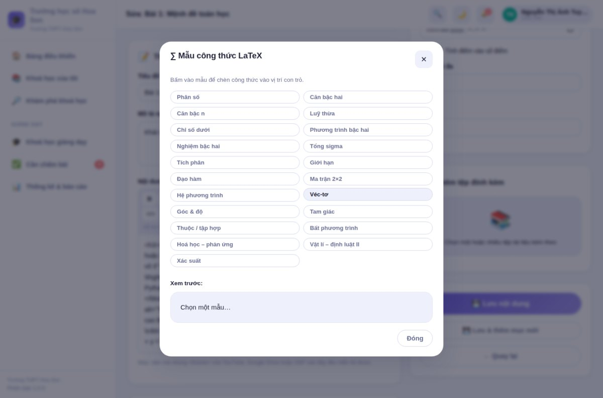

Danh sách mẫu gồm: phân số, căn bậc hai/bậc n, luỹ thừa, chỉ số dưới, phương trình bậc hai và
công thức nghiệm, tổng sigma, tích phân, giới hạn, đạo hàm, ma trận 2×2, hệ phương trình,
véc-tơ, góc & độ, tam giác, tập hợp, bất phương trình, phản ứng hoá học, định luật II Newton, xác suất.

#### Cú pháp công thức

```
Trong dòng:   \(a^2 + b^2 = c^2\)        hoặc   $a^2 + b^2 = c^2$
Riêng dòng:   \[ \int_0^1 x^2\,dx = \frac{1}{3} \]   hoặc   $$ ... $$
Môi trường:   \begin{cases} x + y = 5 \\ 2x - y = 1 \end{cases}
```

#### Kết quả học sinh nhìn thấy

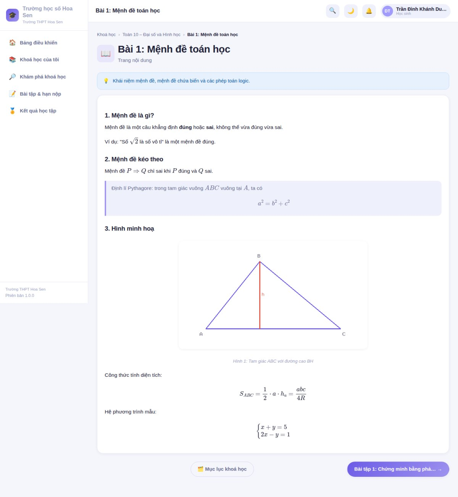

> 💡 **Mẹo:** chụp màn hình rồi **dán thẳng (Ctrl + V)** vào ô soạn thảo — ảnh tự động được
> tải lên và chèn vào bài, không cần lưu ra tệp trước.

Công thức và hình ảnh hiển thị được ở: bài giảng, đề bài tập, câu hỏi trắc nghiệm và phương án
trả lời, nhận xét của giáo viên, bài làm của học sinh, thông báo và diễn đàn.

### 5. Đưa gói SCORM lên hệ thống

Chọn loại nội dung **🧩 Gói SCORM**, rồi tải tệp `.zip` lên:

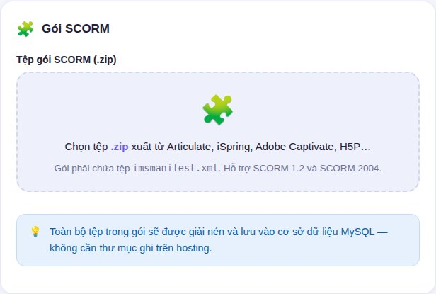

1. Gói phải chứa tệp **`imsmanifest.xml`**. Hỗ trợ **SCORM 1.2** và **SCORM 2004**.
2. Hệ thống tự giải nén, lưu toàn bộ tệp vào MySQL, xác định tệp khởi chạy và mục lục các SCO.
3. Ô **🏅 Tính điểm vào sổ điểm**: bật khi dùng gói SCORM làm **bài tập chấm điểm**
   (điểm SCORM tự quy đổi theo thang điểm và hệ số của mục); tắt nếu chỉ là học liệu tham khảo.
4. Học sinh học ngay trong trang, tiến độ và điểm được ghi tự động.

Theo dõi kết quả cả lớp tại `📊 Kết quả lớp`:

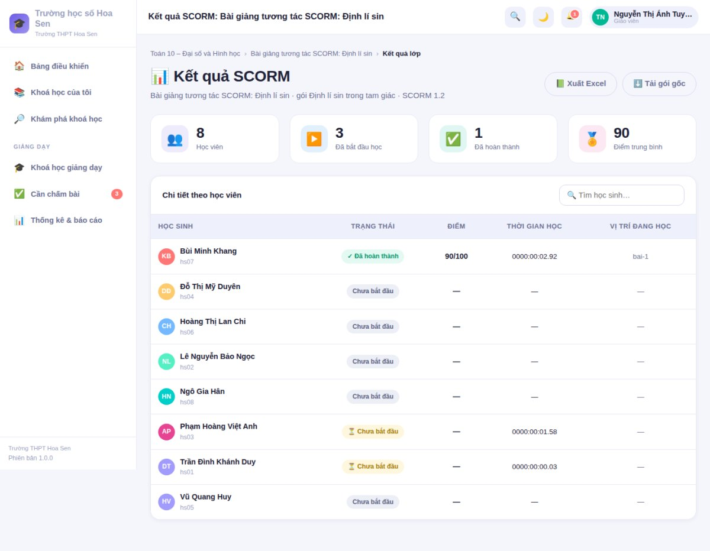

### 6. Giao bài tập

Chọn loại **📝 Bài tập**, phần cấu hình gồm:

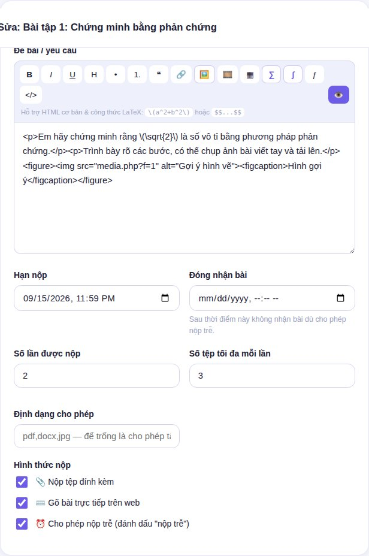

- **Đề bài / yêu cầu** — soạn như bài giảng (có công thức, hình ảnh).
- **Hạn nộp** và **Đóng nhận bài** — sau thời điểm đóng thì không nhận bài dù cho phép nộp trễ.
- **Số lần được nộp**, **số tệp tối đa**, **định dạng cho phép** (`pdf,docx,jpg`…).
- **Hình thức nộp**: nộp tệp và/hoặc gõ bài trực tiếp trên web.
- **Cho phép nộp trễ** — bài nộp muộn được đánh dấu 🟠 *Nộp trễ*.

Khối **🤖 Trợ lý AI chấm bài** ngay bên dưới:

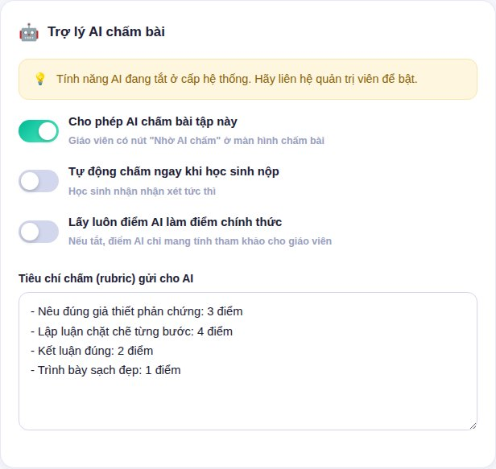

| Công tắc | Ý nghĩa |
|---|---|
| **Cho phép AI chấm bài tập này** | Hiện nút *Nhờ AI chấm* ở màn hình chấm bài |
| **Tự động chấm ngay khi học sinh nộp** | Học sinh nhận nhận xét tức thì |
| **Lấy luôn điểm AI làm điểm chính thức** | Tắt thì điểm AI chỉ để thầy cô tham khảo |
| **Tiêu chí chấm (rubric)** | Bảng điểm thành phần gửi cho AI, ví dụ:<br>`- Nội dung đúng yêu cầu: 4 điểm`<br>`- Lập luận chặt chẽ: 3 điểm`<br>`- Trình bày rõ ràng: 2 điểm`<br>`- Sáng tạo: 1 điểm` |

### 7. Soạn bài trắc nghiệm

Chọn loại **❓ Bài trắc nghiệm** và cấu hình:

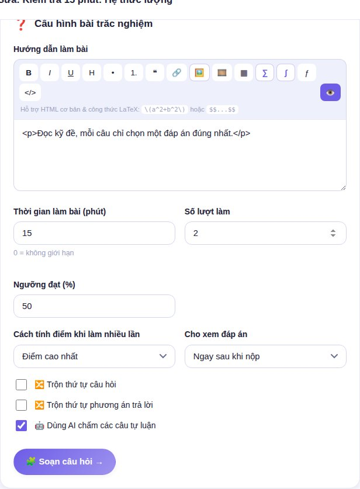

- **Thời gian làm bài** (phút, `0` = không giới hạn), **số lượt làm**, **ngưỡng đạt (%)**.
- **Cách tính điểm khi làm nhiều lần**: điểm cao nhất / lần cuối / lần đầu / trung bình.
- **Cho xem đáp án**: ngay sau khi nộp / sau khi đóng bài / không cho xem.
- **Trộn câu hỏi**, **trộn phương án**, **dùng AI chấm câu tự luận**.

Sau khi lưu, hệ thống chuyển thẳng sang màn hình soạn câu hỏi:

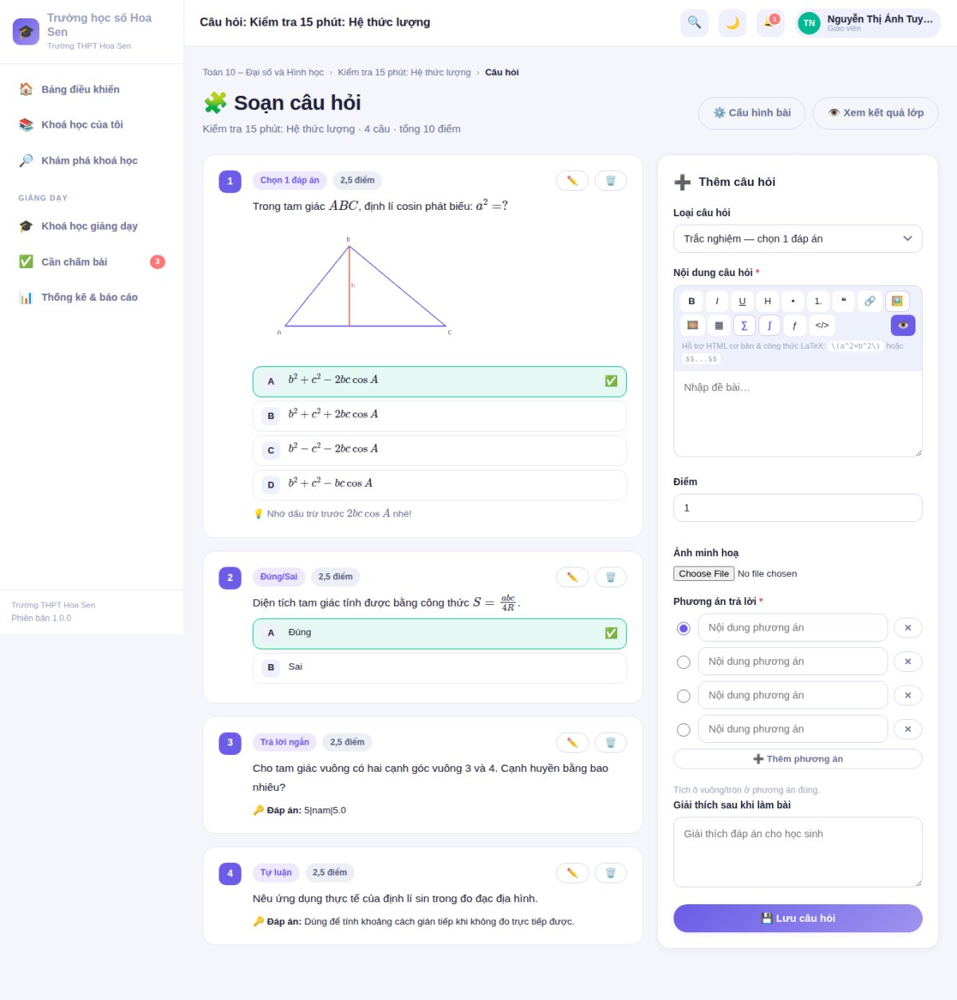

**Năm dạng câu hỏi:**

| Dạng | Chấm điểm | Ghi chú |
|---|---|---|
| Trắc nghiệm — chọn 1 đáp án | Tự động | Phổ biến nhất |
| Trắc nghiệm — chọn nhiều đáp án | Tự động, có điểm thành phần | Chọn sai bị trừ theo tỉ lệ |
| Đúng / Sai | Tự động | Hệ thống tự tạo 2 phương án |
| Trả lời ngắn | Tự động | Nhiều đáp án chấp nhận, ngăn cách bằng `|`; **không phân biệt hoa thường và dấu tiếng Việt** |
| Tự luận | Giáo viên hoặc **AI** chấm | Có ô đáp án gợi ý / tiêu chí chấm |

Mỗi câu hỏi có thể kèm **ảnh minh hoạ**, **công thức LaTeX** và **lời giải thích** hiện sau khi làm bài.

### 8. Chấm bài — thủ công và bằng AI

#### Danh sách bài nộp

`Khoá học → bài tập → ✅` hoặc từ **Cần chấm bài** ở thanh bên.

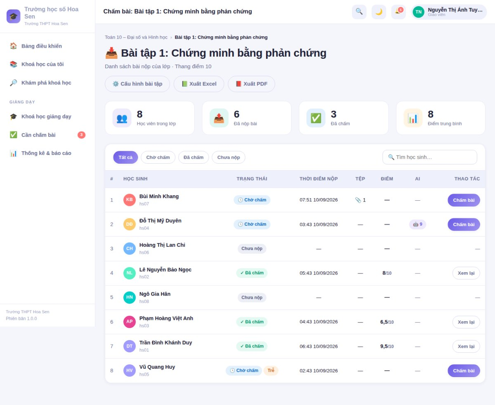

Bốn thẻ lọc: *Tất cả · Chờ chấm · Đã chấm · Chưa nộp*, kèm bốn ô thống kê nhanh
(sĩ số, đã nộp, đã chấm, điểm trung bình). Xuất Excel/PDF ngay tại đây.

#### Màn hình chấm bài

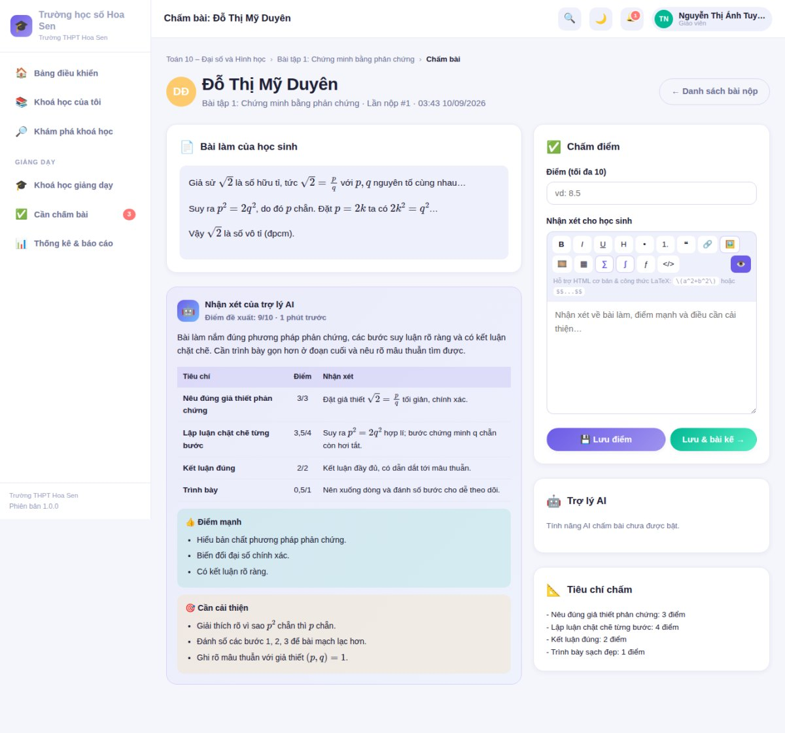

- Bên trái: **bài làm của học sinh** — công thức toán hiển thị đúng, PDF/ảnh/audio/video xem
  trực tiếp không cần tải về.
- Bên phải: ô **điểm**, ô **nhận xét** (có đủ thanh công cụ soạn thảo) và nút
  **💾 Lưu điểm** / **Lưu & bài kế →** để chấm liên tục.
- Nút **✨ Nhờ AI chấm bài này**: AI đọc bài (kể cả **ảnh chụp bài viết tay**), chấm theo rubric
  và trả về **điểm đề xuất**, **bảng tiêu chí**, **điểm mạnh**, **điều cần cải thiện**.
  Điểm đề xuất tự điền vào ô điểm nếu ô còn trống — **thầy cô luôn là người quyết định cuối cùng**.

Danh sách toàn bộ bài cần chấm của mọi lớp:

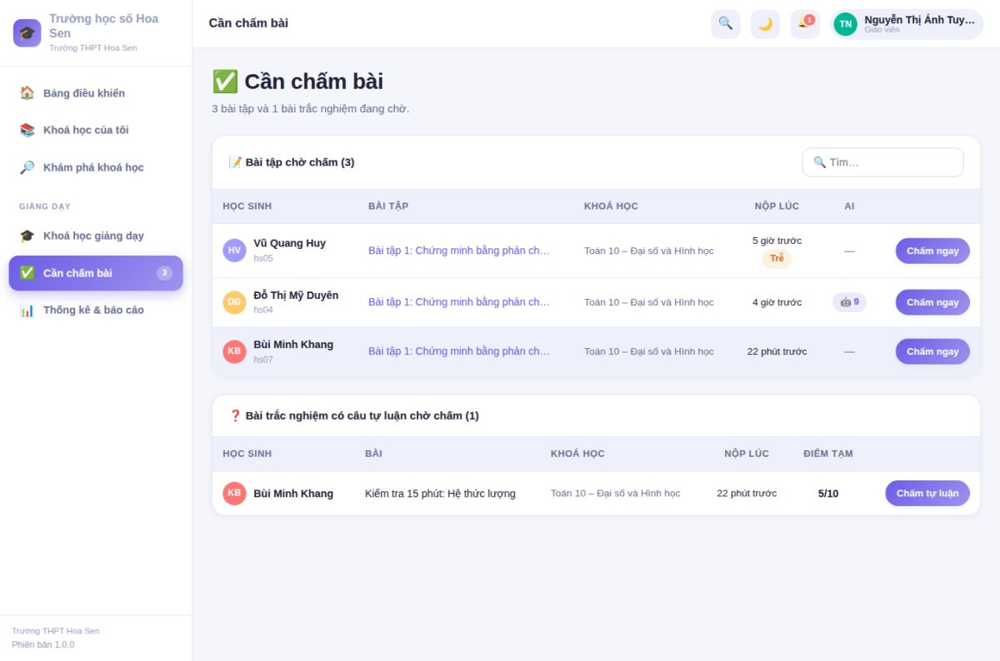

#### Đọc bài nộp ngay trên trang chấm

Bài nộp dạng **Word, PDF, ảnh, âm thanh, video, bảng tính hay văn bản** đều hiện thẳng
dưới thông tin tệp — thầy cô chấm mà không cần tải từng bài về máy:

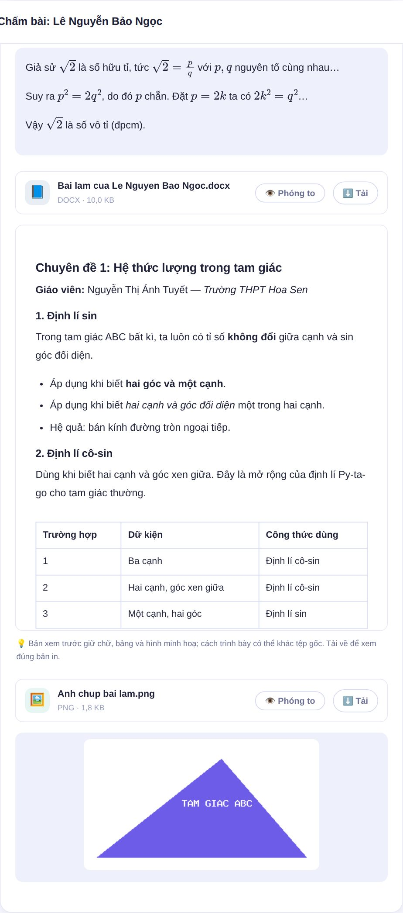

Nút **👁️ Phóng to** mở bài làm trong cửa sổ lớn, dùng phím **← →** để lật nhanh giữa các tệp.

### 9. Sổ điểm và xuất báo cáo

`Khoá học → 📊 Sổ điểm`

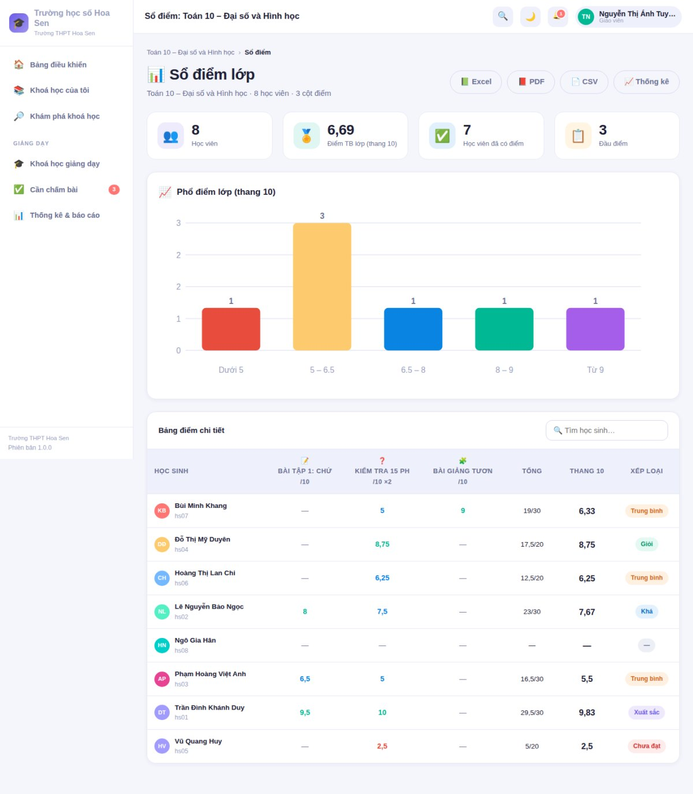

- Bảng ma trận **học sinh × đầu điểm**: cột đầu tiên cố định, cuộn ngang khi nhiều cột.
- Mỗi cột hiển thị **số thứ tự**, **thang điểm** và **hệ số** (`/10 ×2`).
- Ba cột cuối: **Tổng**, **Thang 10**, **Xếp loại** (Xuất sắc · Giỏi · Khá · Trung bình · Chưa đạt).
- Biểu đồ **phổ điểm lớp** phía trên.
- Ô tìm kiếm lọc học sinh ngay tại chỗ, không phân biệt dấu tiếng Việt.

#### Lớp có nhiều đầu điểm

Sổ điểm chịu được **số cột điểm không giới hạn**. Từ **6 đầu điểm trở lên**, giao diện tự chuyển
sang chế độ dành cho bảng rộng:

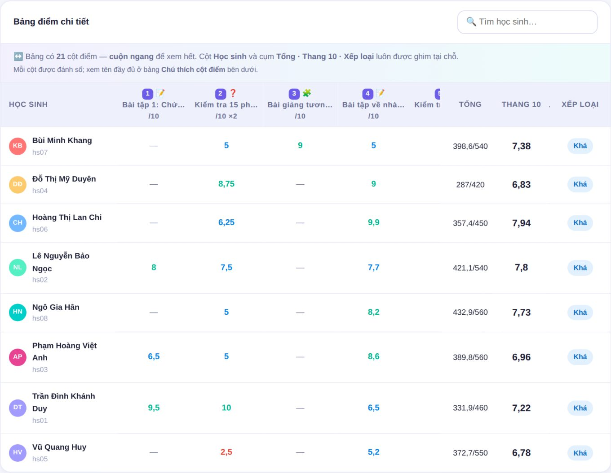

- Dòng nhắc **↔️ cuộn ngang** cho biết bảng còn cột phía sau.
- Cột **Học sinh** ghim bên trái, cụm **Tổng · Thang 10 · Xếp loại** ghim bên phải —
  kéo ngang tới đâu vẫn thấy tên học sinh và kết quả cuối cùng.
- Mỗi cột điểm mang **một số thứ tự** để đối chiếu; rê chuột lên tiêu đề cột để xem tên đầy đủ.
- Trên điện thoại, tiêu đề cột rút gọn còn số thứ tự để xem được nhiều cột hơn.

Bảng **Chú thích cột điểm** ngay dưới sổ điểm cho biết số thứ tự nào ứng với đầu điểm nào
(bấm vào tên để mở thẳng bài tập / bài trắc nghiệm đó):

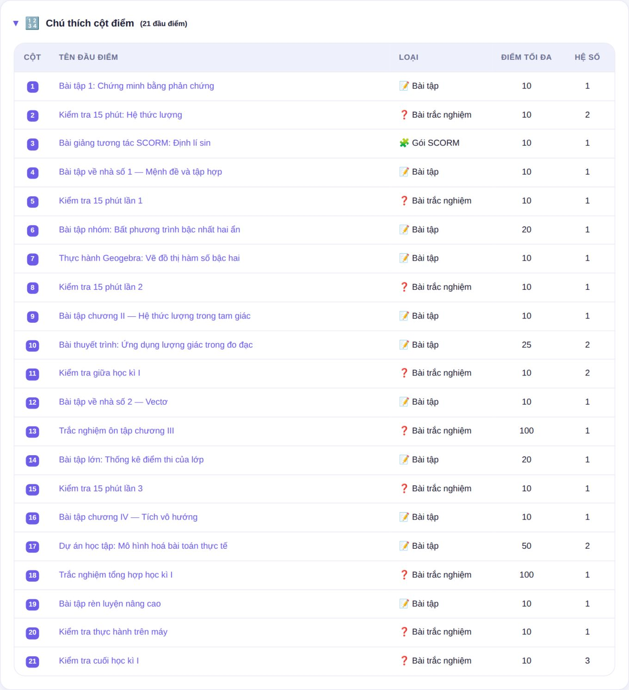

#### Thống kê & báo cáo

`Thống kê & báo cáo` — chọn khoá học ở góc phải:

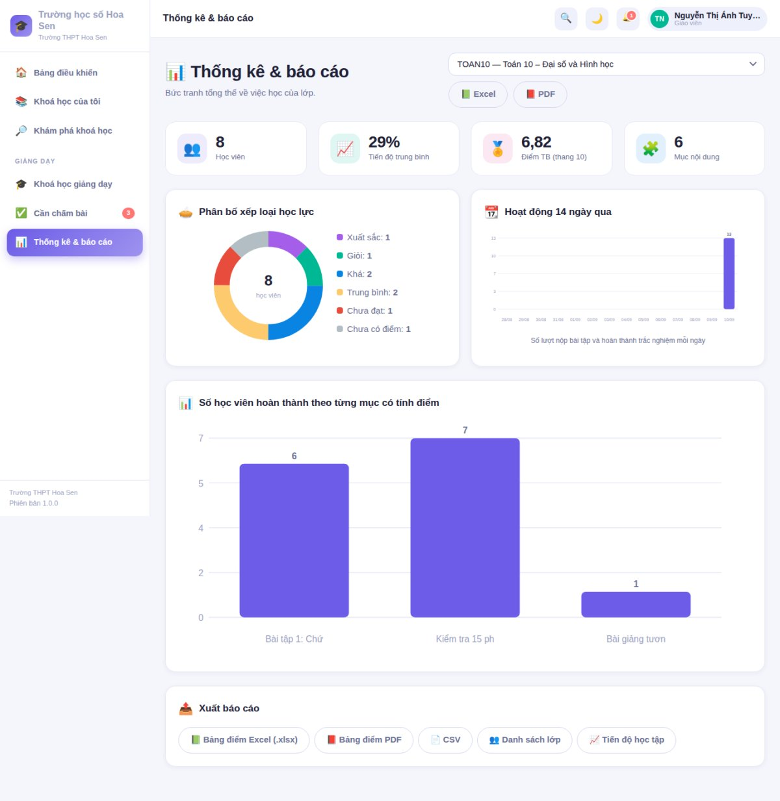

Gồm: tiến độ trung bình, điểm trung bình lớp, **biểu đồ tròn phân bố xếp loại**,
**hoạt động 14 ngày qua**, **mức độ hoàn thành từng đầu điểm**.

#### Xuất tệp

| Nút | Kết quả |
|---|---|
| **📗 Excel (.xlsx)** | Hai trang: *Bảng điểm* (có lọc, cố định dòng tiêu đề) và *Thống kê* |
| **📕 PDF** | Khổ ngang A4, có logo, tên đơn vị, phần tổng hợp và ô ký tên |
| **📄 CSV** | Mở được bằng mọi phần mềm bảng tính |
| **👥 Danh sách lớp** | Họ tên, tài khoản, email, điện thoại, trạng thái, tiến độ |
| **📈 Tiến độ học tập** | Đánh dấu `x` từng mục nội dung đã hoàn thành |

Bảng điểm PDF xuất ra — **tiếng Việt có dấu đầy đủ**:

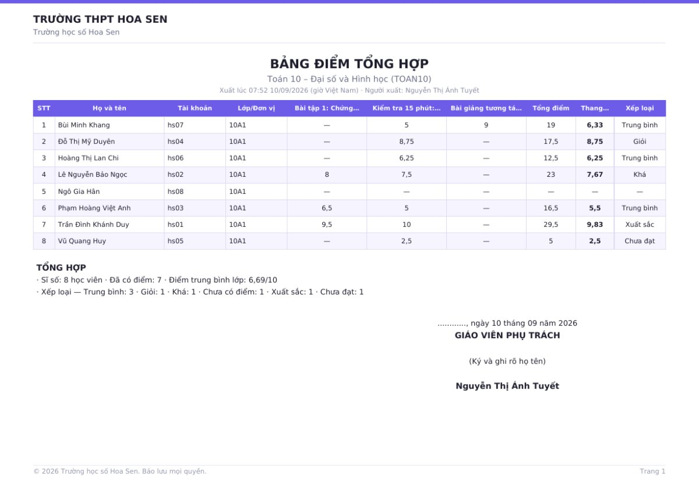

**Khi lớp có nhiều đầu điểm**, bảng điểm PDF **tự chia thành nhiều phần theo chiều ngang**
để không có cột nào bị tràn ra khỏi trang giấy:

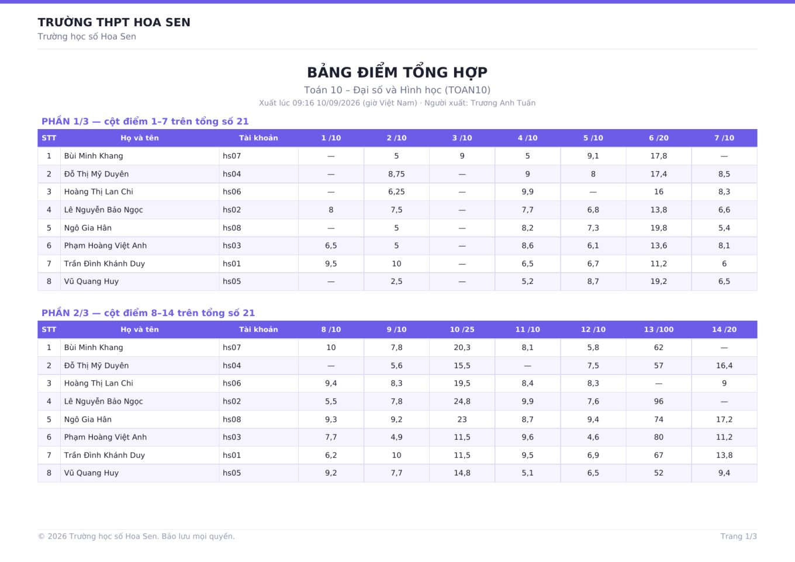

- Mỗi phần ghi rõ *"PHẦN 2/3 — cột điểm 8–14 trên tổng số 21"* và **lặp lại**
  cột STT · Họ và tên · Tài khoản để dễ dò theo hàng.
- Sau các phần điểm thành phần là bảng **KẾT QUẢ TỔNG HỢP** (kèm cột *Số cột đã có điểm*)
  và bảng **CHÚ THÍCH CÁC CỘT ĐIỂM** liệt kê tên đầy đủ, loại, điểm tối đa, hệ số.
- Mọi trang đều có chân trang, dòng bản quyền và số trang dạng `Trang 2/3`.

> 💡 Cần xem tất cả đầu điểm trên **một hàng duy nhất**? Hãy xuất **Excel** hoặc **CSV** —
> hai định dạng này không giới hạn bề ngang.

### 10. Quản lý học viên và thông báo lớp

`Khoá học → 👥 Học viên`


- **Thêm học viên hàng loạt**: dán danh sách tên đăng nhập hoặc email, mỗi dòng một người.
- **Duyệt** yêu cầu ghi danh đang chờ.
- Xem **tiến độ** từng em (thanh màu), gỡ khỏi lớp.
- Thêm **giáo viên đồng phụ trách** — cùng soạn bài và chấm bài.
- Xem và sao chép **mã ghi danh** để phát cho lớp.

Đăng thông báo cho lớp — mọi học viên nhận được ngay trong hệ thống:

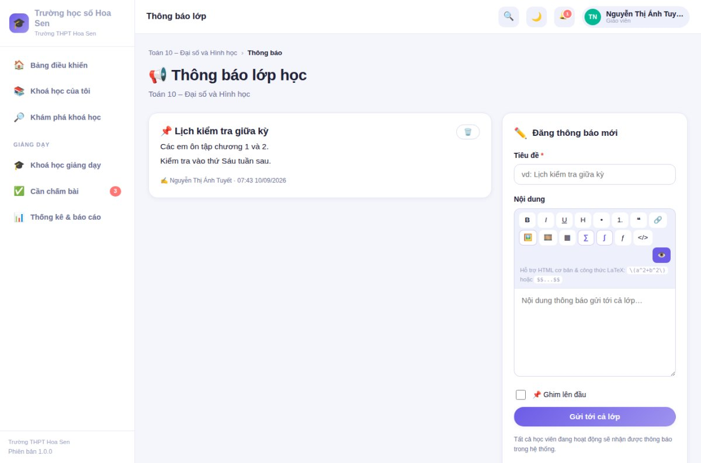

---

## Phần III — Dành cho Học sinh 🧑‍🎓

### 1. Bảng điều khiển

Sau khi đăng nhập, em thấy ngay: khoá học đang theo kèm **tiến độ**, số mục đã hoàn thành,
bài **chưa làm**, **điểm trung bình**, bài **sắp đến hạn**, điểm mới nhận và thông báo.


### 2. Tham gia khoá học

`Khám phá khoá học` → chọn khoá → **🎉 Tham gia ngay**
(có thể cần **mã ghi danh** do thầy cô cung cấp, hoặc chờ thầy cô duyệt).

Khoá học của em nằm ở mục **Khoá học của tôi**, kèm phần trăm tiến độ:

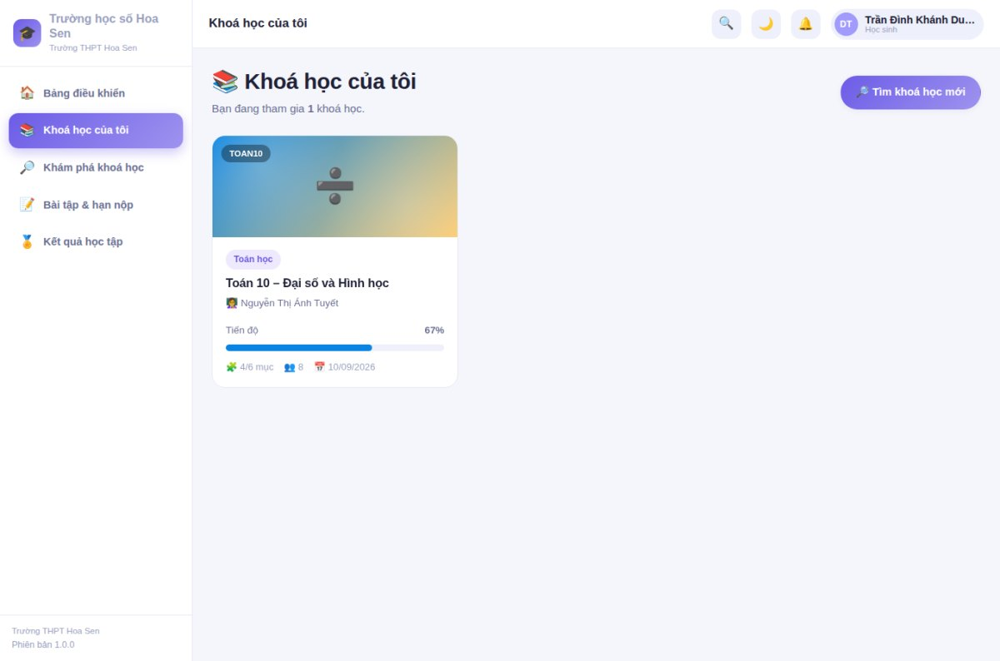

### 3. Học bài

Trang khoá học liệt kê nội dung theo từng chương. Mục đã hoàn thành có dấu ✅,
mục đã chấm điểm hiện 🏅 kèm điểm.

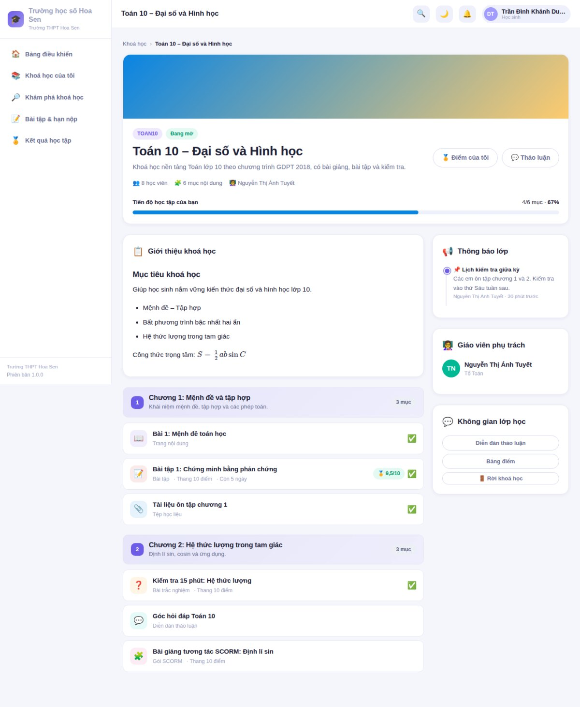

Bài giảng hiển thị đầy đủ **công thức toán** và **hình minh hoạ**:


Cuối mỗi bài có nút chuyển sang **bài trước / bài kế tiếp** để học liên mạch.

#### Xem trước tài liệu đính kèm — không cần tải về

Mỗi tệp thầy cô đính kèm đều có nhãn **👁️ Xem trước**. Bấm vào tệp là nội dung mở ra ngay
trong một cửa sổ lớn — đọc được cả trên máy tính phòng máy lẫn điện thoại, không cần cài
Word hay Excel:

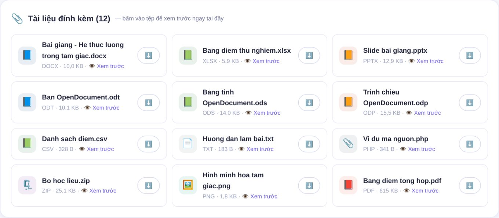

| Loại tệp | Xem trước hiển thị |
|---|---|
| **Word** `.docx` | Toàn bộ bài giảng: tiêu đề, chữ in đậm/nghiêng/gạch chân, chỉ số trên–dưới, danh sách, bảng, **hình minh hoạ** và liên kết |
| **Excel** `.xlsx` | Từng trang tính có thẻ chuyển, dữ liệu dạng bảng, ngày tháng đổi sang `dd/mm/yyyy`, số căn phải |
| **PowerPoint** `.pptx` | Nội dung chữ từng slide, có tiêu đề và các gạch đầu dòng |
| **PDF** | Mở thẳng trong trang, cuộn và tìm kiếm như bình thường |
| **Ảnh · Video · Âm thanh** | Xem/phát ngay, video và âm thanh tua được |
| **OpenDocument** `.odt` `.ods` `.odp` | Nội dung chữ; riêng `.ods` dựng lại thành bảng |
| **CSV · TXT · SRT · mã nguồn** | Bảng dữ liệu hoặc văn bản có đánh số dòng |
| **ZIP** | Danh sách các tệp bên trong kèm dung lượng |

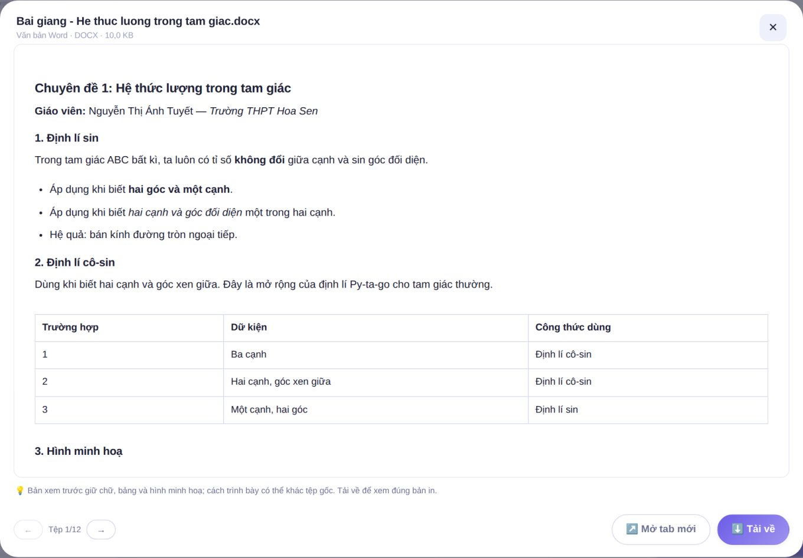

- Dùng phím **← →** hoặc hai nút mũi tên ở góc dưới để lật nhanh sang tệp kế tiếp.
- Phím **Esc** hoặc nút ✕ để đóng.
- Nút **↗️ Mở tab mới** xem tệp gốc, nút **⬇️ Tải về** lưu vào máy như trước.

Bảng tính Excel hiện đúng từng trang tính:

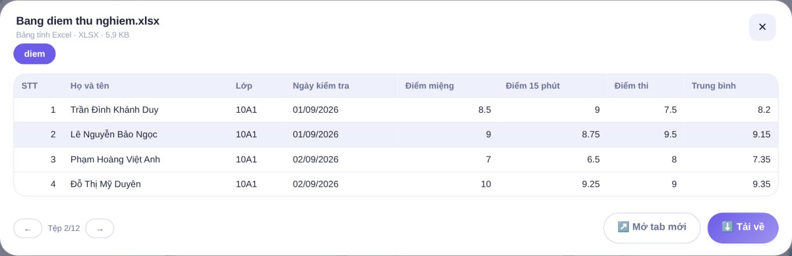

Bài trình chiếu hiện nội dung từng slide:

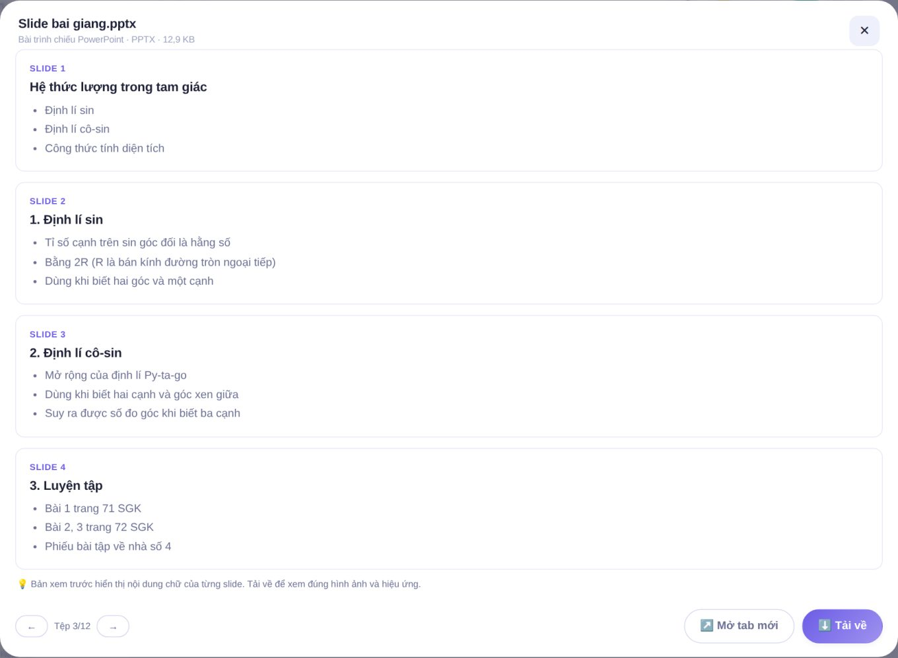

### 4. Học bài giảng SCORM

Bài giảng tương tác chạy ngay trong trang. Trạng thái và điểm được **lưu tự động**;
nút ⛶ để xem toàn màn hình, nút 💾 để lưu tiến độ ngay lập tức.

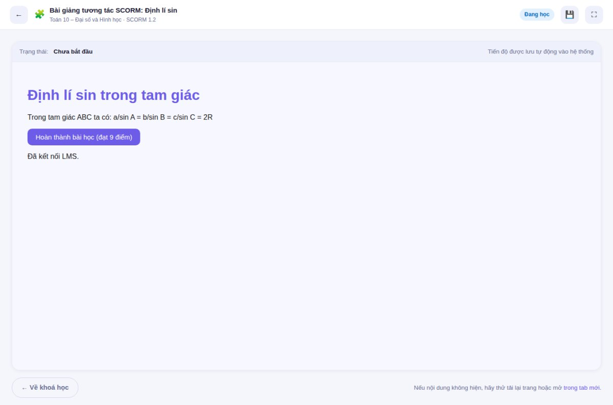

### 5. Nộp bài tập

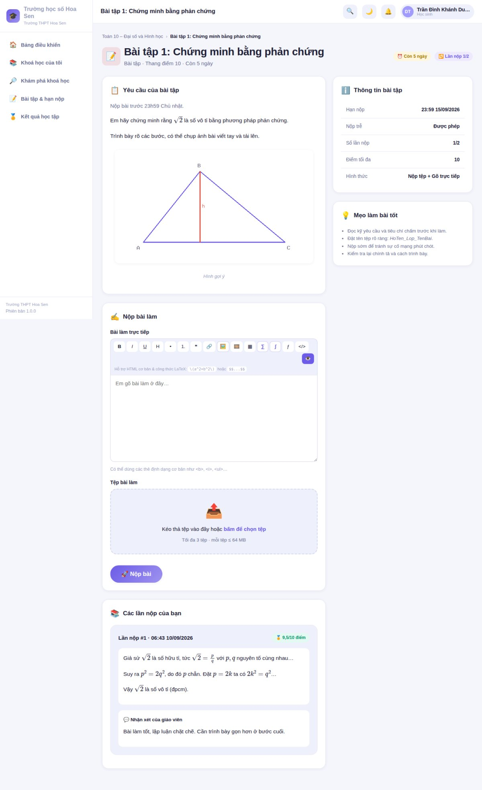

1. Đọc kỹ **yêu cầu của bài tập** và tài liệu kèm theo.
2. Gõ bài trực tiếp (có thanh công cụ chèn **công thức**, **ảnh**) và/hoặc **kéo thả tệp** vào ô tải lên.
3. Bấm **🚀 Nộp bài**.
4. Nếu thầy cô cho phép, bấm **✨ Nhờ AI nhận xét bài** để nhận góp ý ngay.
5. Xem lại tất cả các lần nộp, điểm và nhận xét của thầy cô ở phần *Các lần nộp của bạn*.

> ⏰ Khối **Thông tin bài tập** bên phải luôn hiện hạn nộp, số lần nộp còn lại và điểm tối đa.

### 6. Làm bài trắc nghiệm

Trang giới thiệu cho biết số câu, tổng điểm, thời gian, số lượt làm và cách tính điểm:

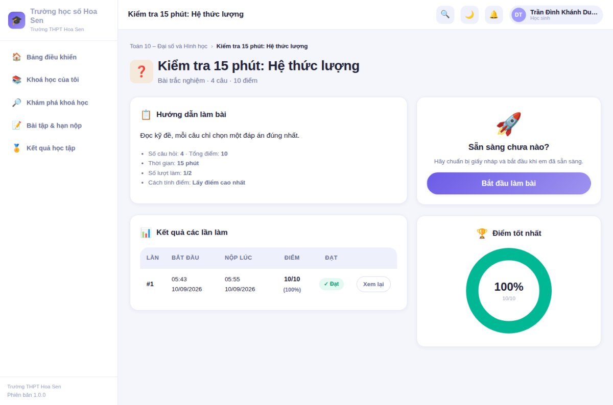

Khi làm bài: **đồng hồ đếm ngược**, thanh **điều hướng câu hỏi** (câu đã làm tô màu),
và mỗi câu **tự động lưu** ngay khi chọn/gõ — mất mạng hay đóng nhầm trình duyệt cũng không mất bài.

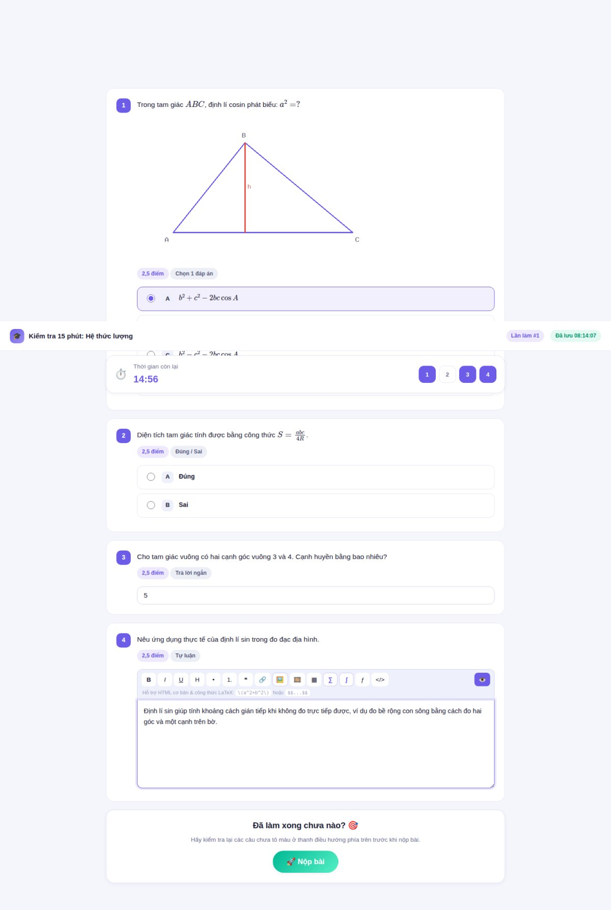

Nộp bài xong hiện kết quả ngay (nếu thầy cô cho phép xem): điểm, phần trăm, đạt/chưa đạt,
số câu đúng – sai – bỏ trống và **đáp án đúng kèm giải thích** của từng câu.

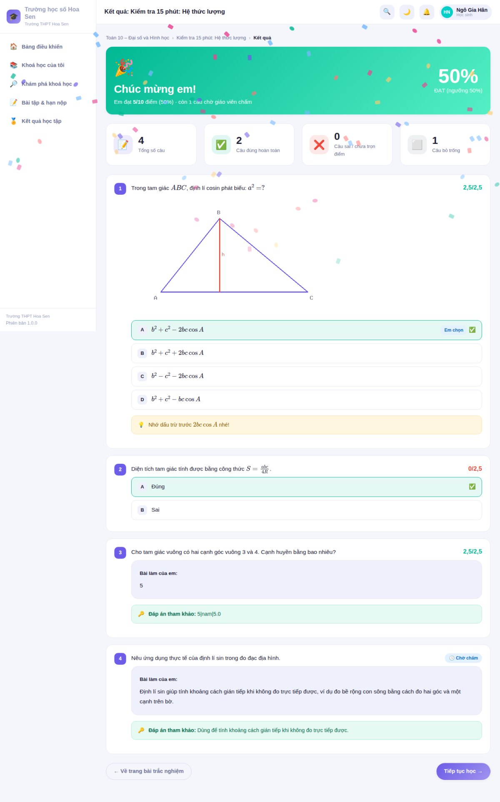

### 7. Xem kết quả học tập

`Kết quả học tập` — điểm từng đầu điểm, quy đổi **thang 10** và **xếp loại**:

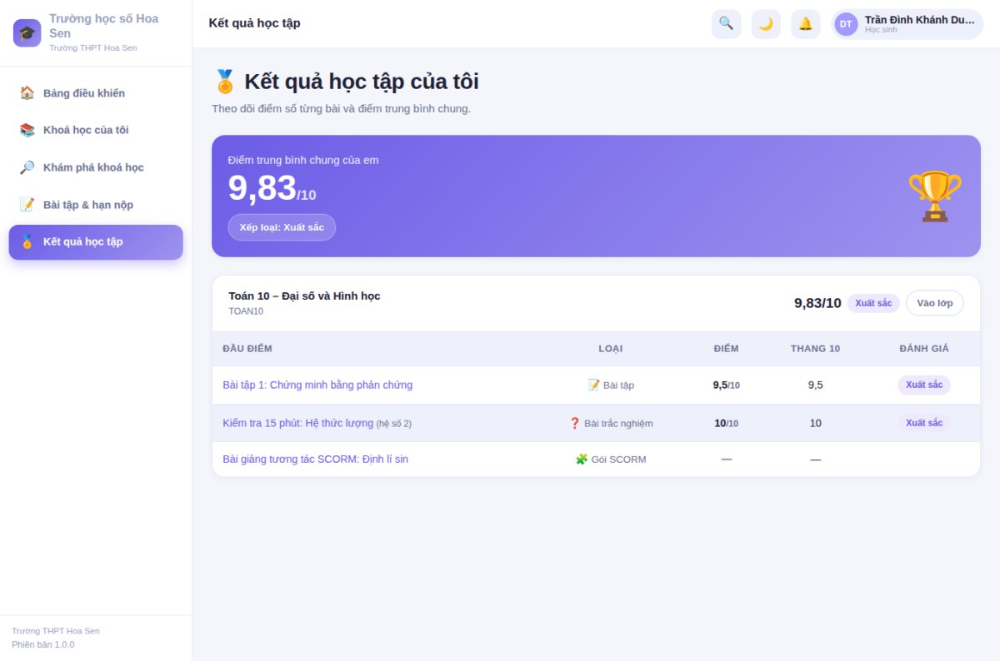

Trong `Hồ sơ cá nhân` có nút tải **phiếu kết quả PDF** và **bảng điểm Excel**:

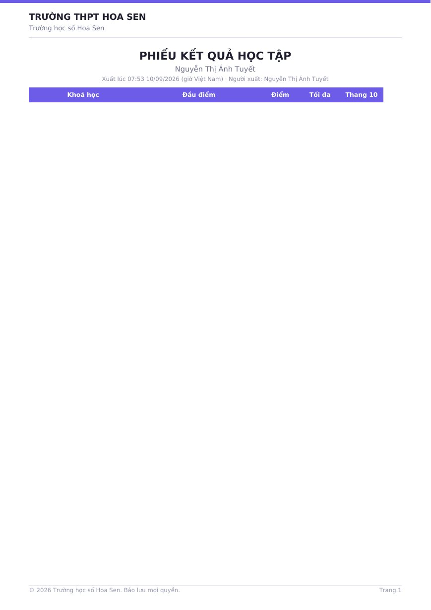

### 8. Theo dõi hạn nộp

`Bài tập & hạn nộp` liệt kê mọi bài của tất cả các lớp, sắp xếp theo hạn gần nhất:

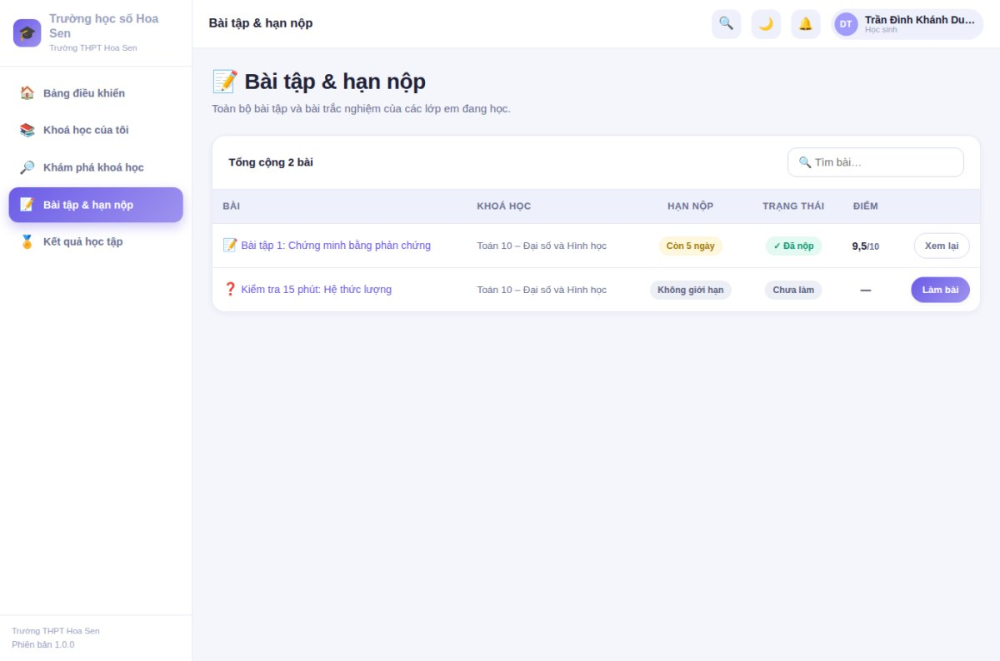

### 9. Thảo luận với thầy cô và các bạn

Mỗi lớp có diễn đàn riêng; câu hỏi và câu trả lời đều hiển thị được công thức toán:

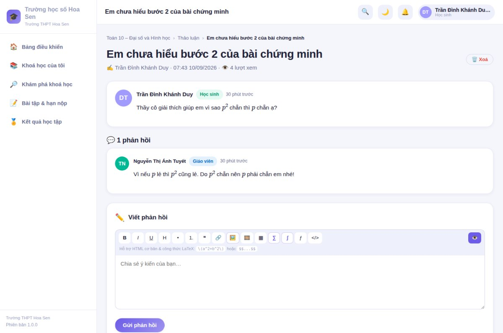

### 10. Hồ sơ cá nhân

Cập nhật họ tên, email, điện thoại, ngày sinh, lớp và **ảnh đại diện**:

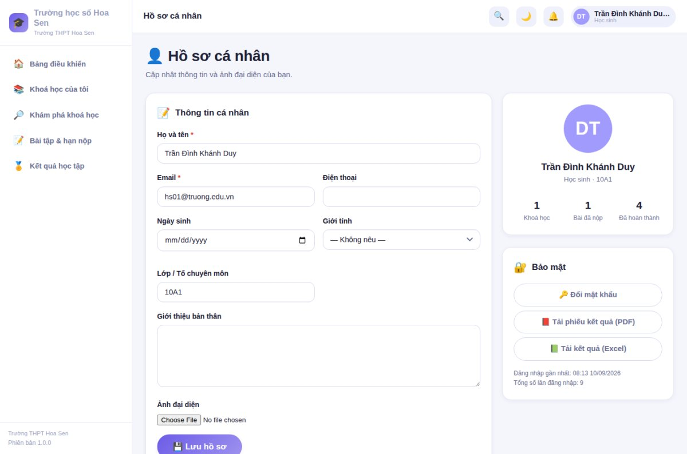

### 11. Học trên điện thoại

Toàn bộ giao diện tự co giãn theo màn hình. Bấm ☰ để mở thanh điều hướng.

| Bảng điều khiển | Bài giảng có công thức |
|---|---|
| 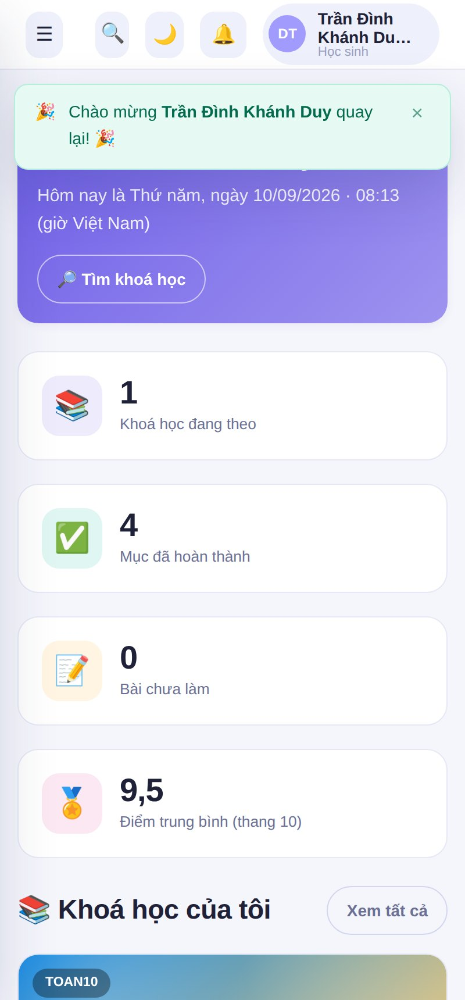 | 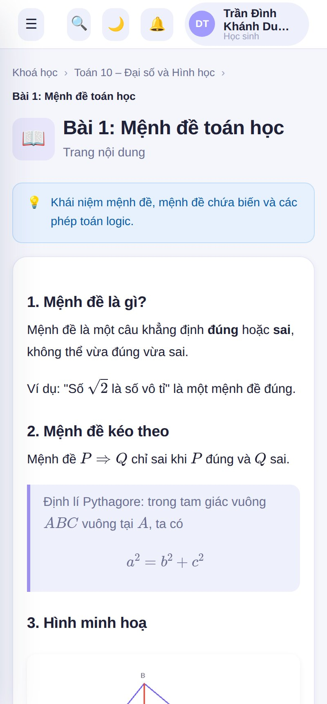 |

---

## Phần IV — Mẹo nhỏ & câu hỏi thường gặp

### Mẹo dùng nhanh

- 🌙 **Đổi giao diện sáng/tối**: nút mặt trăng trên thanh trên cùng, hệ thống ghi nhớ lựa chọn.
- 🔍 **Ô tìm kiếm trong bảng**: lọc ngay tại chỗ, **không phân biệt dấu tiếng Việt** —
  gõ `nguyen` vẫn tìm ra `Nguyễn`.
- 🖨️ **In trực tiếp**: trang sổ điểm và danh sách có bố cục in riêng (Ctrl + P).
- 📋 **Sao chép mã ghi danh**: bấm nút *Sao chép mã* ở trang học viên.
- ⌨️ **Dán ảnh**: Ctrl + V ảnh chụp màn hình thẳng vào ô soạn thảo.
- 👁️ **Xem trước tệp**: bấm vào tệp đính kèm để đọc ngay; phím **← →** lật tệp, **Esc** đóng.

### Câu hỏi thường gặp

**Hỏi: Học sinh làm bài lâu có bị đăng xuất không?**
Không. Phiên đăng nhập mặc định **12 giờ** và được tự động gia hạn khi trang còn mở.
Bài trắc nghiệm còn tự lưu từng câu ngay khi chọn đáp án.

**Hỏi: Công thức hiện ra dạng `\(x^2\)` chứ không thành công thức?**
Vào `Quản trị → Cấu hình chung → Công thức toán` kiểm tra công tắc *Bật hiển thị công thức LaTeX*
và đường dẫn thư viện MathJax (mặc định là bản cài kèm `assets/js/mathjax/tex-mml-chtml.js`).

**Hỏi: Tải tệp lớn báo lỗi?**
Xem mục 5.2 và 5.3 trong [Hướng dẫn cài đặt](HUONG-DAN-CAI-DAT.md) — cần tăng
`upload_max_filesize` và có thể giảm *Kích thước mảnh lưu CSDL*.

**Hỏi: AI chấm bài có thay thầy cô cho điểm không?**
Không, trừ khi thầy cô chủ động bật *"Lấy luôn điểm AI làm điểm chính thức"* cho bài tập đó.
Mặc định điểm AI chỉ là **gợi ý tham khảo**.

**Hỏi: Gói SCORM nào dùng được?**
Mọi gói xuất theo chuẩn **SCORM 1.2** hoặc **SCORM 2004** có tệp `imsmanifest.xml`
(Articulate Storyline/Rise, iSpring, Adobe Captivate, H5P, Lectora…).

**Hỏi: Học sinh không có Word/Excel trên máy thì đọc học liệu kiểu gì?**
Không cần cài gì cả. Bấm vào tệp đính kèm là nội dung mở ngay trong trang —
Word giữ được tiêu đề, bảng và hình minh hoạ; Excel hiện từng trang tính;
PowerPoint hiện nội dung từng slide; PDF, ảnh, video, âm thanh mở/phát thẳng.
Việc đọc tệp do máy chủ tự làm bằng PHP, **không gửi tệp ra dịch vụ bên ngoài**.

**Hỏi: Tệp `.doc` (Word đời cũ) có xem trước được không?**
Chưa. Các định dạng nhị phân đời cũ `.doc` `.xls` `.ppt` chỉ tải về được.
Hãy mở bằng Word/Excel/PowerPoint rồi **lưu lại dưới dạng `.docx` `.xlsx` `.pptx`**
và tải lên lại — cả lớp sẽ xem được ngay trên trang.

**Hỏi: Lớp có hai ba chục đầu điểm thì bảng điểm hiển thị có nổi không?**
Có. Trên màn hình, cột **Học sinh** ghim bên trái và cụm **Tổng · Thang 10 · Xếp loại**
ghim bên phải, phần điểm ở giữa cuộn ngang; mỗi cột mang một số thứ tự tra được ở bảng
*Chú thích cột điểm* bên dưới. Khi xuất **PDF**, bảng điểm **tự chia thành nhiều phần
theo chiều ngang** (mỗi phần lặp lại họ tên) rồi kết thúc bằng bảng tổng hợp và bảng chú thích —
không có cột nào bị cắt mất. Muốn xem tất cả trên một hàng thì xuất **Excel** hoặc **CSV**.

**Hỏi: Dữ liệu lưu ở đâu, sao lưu thế nào?**
Tất cả — kể cả tệp học liệu và gói SCORM — nằm trong **cơ sở dữ liệu MySQL**.
Chỉ cần sao lưu CSDL bằng cPanel hoặc phpMyAdmin là đủ.

---

📘 Xem thêm: [Hướng dẫn cài đặt lên hosting cPanel](HUONG-DAN-CAI-DAT.md) ·
📜 [Lịch sử phiên bản](../CHANGELOG.md)
